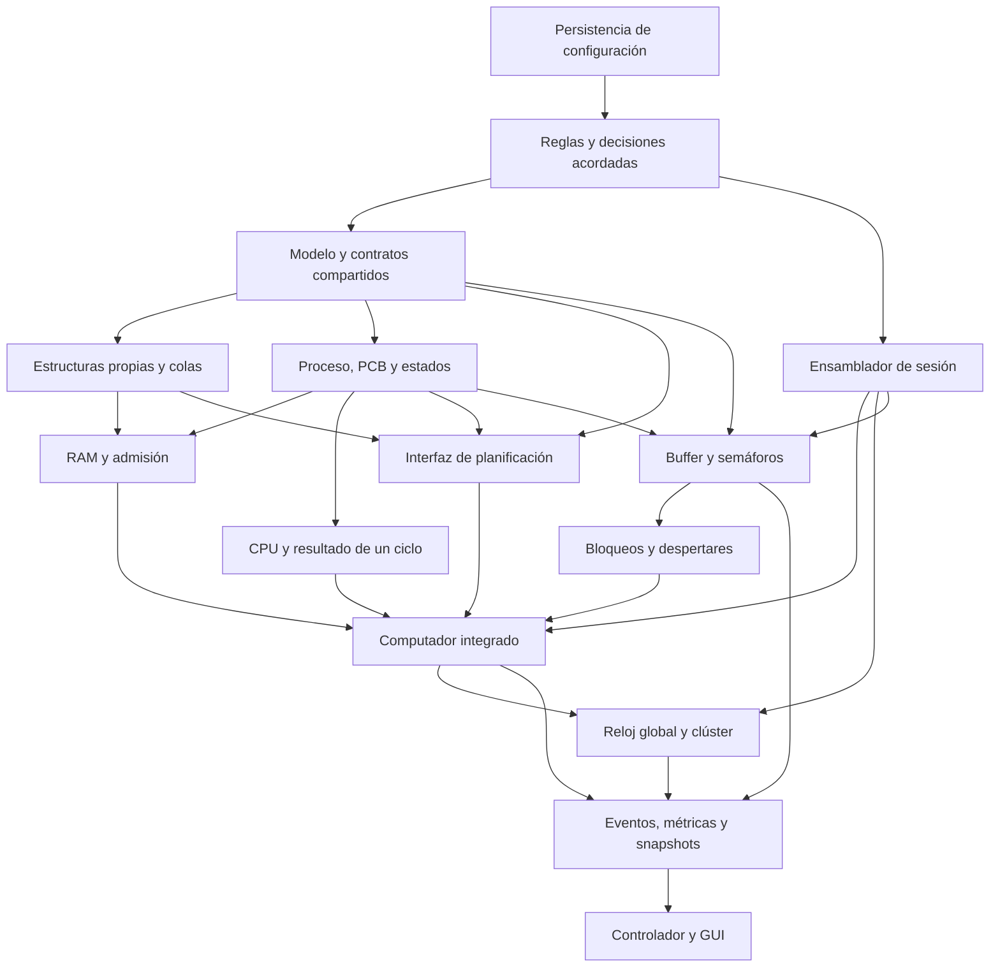

# ÁvilaOS — mapa funcional y arquitectura por contratos (borrador)

**Estado:** propuesta para revisar. No es arquitectura aprobada y todavía no autoriza empezar a programar.

**Propósito:** llegar a un nivel donde podamos ordenar el desarrollo por dependencias, sabiendo qué ofrece y qué necesita cada caja, sin diseñar por adelantado cada algoritmo interno.

## 1. Qué fija el enunciado

- Java posterior a Java 21; uso de NetBeans.
- Clúster de al menos dos computadores, instancias de una misma clase, RAM limitada y un reloj global.
- Procesos monohilo con identificador único global, ciclo de estados y un PCB visible.
- FCFS, EDF, Round Robin configurable y prioridades apropiativas. Cada computador tiene y puede cambiar su política independientemente.
- Procesos con perfil CPU, E/S, productor o consumidor; productores y consumidores usan buffers acotados, semáforos y pueden acceder remotamente con latencia.
- Memoria se reserva al admitir un proceso y se libera al terminar; no se modelan disco ni memoria virtual.
- GUI con control, vistas por computador, vista global, log y métricas.
- Uso obligatorio de threads y semáforos Java para la sincronización de estructuras compartidas. Las estructuras de datos del simulador se implementan propias; no se usan las colecciones prohibidas de `java.util`.
- Configuración reutilizable en CSV o JSON; el gráfico muestra utilización de CPU por computador a lo largo del tiempo.

## 2. Principio de las cajas

La lógica interna queda detrás de contratos. Una caja recibe datos explícitos y devuelve un resultado explícito; cuando modifica estado o publica eventos, eso forma parte del contrato. La GUI sólo envía comandos y consulta snapshots. No decide estados de procesos, asignaciones de CPU ni operaciones de buffers.

Los nombres de tipos que siguen son etiquetas de diseño, no nombres de clases definitivos.

## 3. Cajas funcionales y contratos propuestos

| Caja | Responsabilidad y estado propio | Entrada | Salida / efecto visible | Depende de |
|---|---|---|---|---|
| **Validador de configuración** | Revisar límites y coherencia antes de crear una simulación. No conserva el estado de ejecución. | Configuración inicial: ciclo, computadores y RAM, políticas, quantum, latencia, procesos y buffers. | Configuración normalizada o lista de errores por campo; no inicia la simulación si hay errores. | Tipos del dominio y reglas de validación. |
| **Lector/escritor de configuración** | Guardar y recuperar configuraciones futuras. | Archivo CSV/JSON y datos de configuración. | Configuración sin validar al leer; archivo guardado al escribir. | Validador y formato elegido. |
| **Ensamblador de simulación** | Construir una sesión a partir de una configuración válida y conectar sus componentes. | Configuración validada. | Sesión con computadores, buffers, reloj, métricas y fuente de eventos conectados. | Validador, computador, fábrica de procesos/buffers y reloj. |
| **Registro de procesos e IDs** | Asignar ID único en todo el clúster y colocar el proceso en el computador elegido. | Solicitud de proceso, perfil y destino manual o automático. | Identidad creada y resultado de asignación, o error de validación; publica evento. | Tipos de proceso, computador y regla de asignación. |
| **Computador** | Ser la unidad reutilizable que agrupa CPU, RAM, núcleo, colas, política y proceso actual. Es dueño de su estado local. | Un ciclo global, alta de proceso, cambio de política y señales de dispositivos/buffers. | Resultado del ciclo, eventos y snapshot local. | CPU, memoria, colas, admisión, planificador y sincronización. |
| **Admisión y memoria** | Controlar la cola de nuevos y reservar/liberar memoria. | Proceso nuevo, memoria libre, terminación y solicitud de admisión. | Proceso pasa a Listo si hay memoria; si no, sigue en Nuevo. Al liberarse memoria, revisa quién puede entrar. | Computador, proceso y colas propias. |
| **Colas del sistema** | Representar nuevos, listos, bloqueados y terminados con estructuras propias. Mantener orden y acceso seguro entre threads. | Inserción, extracción, búsqueda o cambio de orden. | Elemento afectado, resultado de búsqueda y vista ordenada. | Nodos/listas propias; mecanismo de exclusión mutua basado en semáforos Java. |
| **Política de planificación** | Elegir el próximo proceso y decidir si corresponde desalojar el actual. No ejecuta instrucciones ni administra memoria. | Proceso actual, vista de listos, ciclo actual, deadline y quantum/configuración pertinente. | Decisión: conservar, seleccionar o desalojar; proceso elegido y orden requerido para la cola. | PCB, colas y enum de política. La misma interfaz cubre FCFS, EDF, RR y prioridades apropiativas. |
| **CPU / ejecución de instrucción** | Ejecutar como máximo la instrucción/ciclo de la CPU asignado, actualizar PC y MAR, y marcar modo usuario/SO. | Proceso asignado, ciclo global y operación que toca ejecutar. | Resultado: continúa, terminó, pide E/S, solicita operación de buffer, vence deadline o debe bloquearse; estado de PC/MAR actualizado. | Proceso/PCB y descripción de operación. No elige el siguiente proceso. |
| **Perfil de proceso** | Determinar qué trabajo representa cada tipo y cuándo solicita sus operaciones. | PC, ciclo, parámetros del proceso (trabajo restante, intervalo, buffer y cantidad objetivo). | Próxima operación simulada y actualización del trabajo restante. | PCB; para productor/consumidor, contrato de buffer. Los perfiles CPU/E/S necesitan reglas concretas por definir. |
| **Reloj global** | Numerar ciclos y coordinar el avance de todos los computadores exactamente una vez por ciclo. | Iniciar, pausar, reanudar, avanzar un paso o detener. | Número de ciclo y resultados de avance; notifica a los observadores. | Computadores y mecanismo de coordinación de threads aún por decidir. |
| **Gestor de buffers acotados** | Encontrar el buffer anfitrión, reconocer acceso local/remoto y aplicar latencia de red. | Solicitud de producir/consumir, proceso, computador origen y ciclo. | Operación completada, pendiente por latencia o proceso bloqueado; eventos de acceso. | Buffer acotado, semáforos simulados, computadores y reloj. |
| **Buffer acotado** | Mantener contenido hasta su capacidad y coordinar productor/consumidor con semáforos. | Solicitud de insertar/extraer y señalización cuando cambie disponibilidad. | Éxito, espera por buffer lleno/vacío/mutex, o proceso despertado; actualiza contadores y colas de espera. | Estado de procesos y contrato de sincronización. |
| **Despachador de bloqueos** | Cambiar un proceso a Bloqueado con motivo y retirarlo de CPU; devolverlo a Listo cuando su condición se cumpla. | Solicitud de espera y notificación de semáforo, latencia o E/S cumplida. | Transición de estado, motivo/cola de bloqueo y proceso despertado; libera CPU cuando corresponde. | Computador, colas, CPU y buffer/E/S. |
| **Registro de eventos** | Conservar decisiones importantes en orden temporal para el log y diagnósticos. | Evento tipado con ciclo, computador y datos relevantes. | Historial consultable/visible; no toma decisiones del sistema. | Todos los productores de eventos. |
| **Métricas** | Calcular mediciones locales y globales sin ser dueño de la simulación. | Eventos y muestras por ciclo de CPU/procesos/buffers. | Throughput, uso de CPU, respuesta promedio, deadlines, equidad, conteos por buffer y espera media. | Registro de eventos y reloj. Las fórmulas de respuesta y equidad están pendientes. |
| **Consultor de estado** | Producir una vista coherente para la GUI sin entregar objetos internos mutables. | Solicitud de snapshot global o de computador. | DTO de vista: CPU/PC/modo, colas/causas, RAM, política, buffers, semáforos, métricas y ciclo. | Computadores, buffers, métricas y registro de eventos. |
| **Controlador de simulación** | Traducir acciones de la interfaz en comandos del sistema. | Comandos validados: iniciar/pausar/paso, crear proceso/buffer, cambiar política, pedir snapshot. | Resultado de comando o errores legibles; delega en las cajas de aplicación. | Ensamblador/sesión, validador, reloj y consultor de estado. |
| **GUI** | Presentar vistas y pedir comandos; validar entrada y renderizar cambios en tiempo real. | Acciones del usuario y snapshots/eventos. | Formularios, panel global, panel por computador, selectores, gráfico de utilización y log. | Controlador y DTOs. Nunca muta directamente CPU, colas o buffers. |

## 4. Flujo de datos principal

### Crear y arrancar una simulación

```text
Usuario → GUI → Controlador → Validador → Ensamblador
                                      ├── crea computadores
                                      ├── crea procesos/buffers e IDs
                                      ├── conecta métricas y registro de eventos
                                      └── conecta reloj global
```

### Avanzar un ciclo

```text
Reloj global
  → cada computador avanza una vez
      → revisar deadlines y admisión de memoria
      → planificador elige/conserva/desaloja
      → CPU ejecuta un paso
      → operación puede completar, terminar, bloquear o pedir buffer/E/S
      → colas/estado/memoria se actualizan
      → eventos y mediciones se publican
  → se publica snapshot global
  → GUI representa ese snapshot
```

El orden fino dentro del ciclo debe fijarse antes de implementar, porque cambia casos como deadline que vence en el ciclo de finalización, proceso recién admitido que podría correr enseguida, y buffer que despierta un proceso en el mismo ciclo.

### Operación productor/consumidor

```text
CPU ejecuta operación de proceso
  → Gestor de buffers determina local/remoto
  → si remoto, contabiliza latencia como espera simulada
  → Buffer intenta semáforos de capacidad y mutex
  → éxito: actualiza contenido y despierta esperadores aplicables
  → sin permiso: proceso pasa a Bloqueado y CPU queda disponible
  → evento/métrica/snapshot informan el resultado
```

## 5. Interdependencias y orden candidato de desarrollo

Las flechas significan “necesita el contrato/resultado de” y no obligan a implementar una caja completa antes de diseñar las demás.



Orden candidato para trabajo vertical e integrable:

1. Acordar semántica del ciclo, estados/transiciones, causas de bloqueo, deadline y contratos DTO/evento.
2. Diseñar interfaces públicas del dominio y de las cajas; definir estructuras propias necesarias y sus contratos de concurrencia.
3. Modelar y recorrer manualmente **un computador**, proceso lineal, PC/MAR, RAM, admisión, cola de listos y terminación.
4. Añadir y comparar las cuatro políticas dentro de ese computador; acordar qué significa cambio de política durante ejecución.
5. Envolver computadores idénticos en reloj/clúster y confirmar un ciclo común; incorporar creación con ID global y asignación manual.
6. Añadir estados de bloqueo y despertar primero con una causa sencilla; después integrar buffer acotado, productores/consumidores múltiples y semáforos.
7. Añadir acceso remoto y latencia; definir qué cuenta como ciclo de espera y cuándo se completa un acceso.
8. Conectar eventos y fórmulas de métricas; validar métricas por computador y globales.
9. Implementar guardado/carga de configuración y los controles de GUI contra contratos ya estables.
10. Integrar gráficos, validación de formularios, log y revisión de escenarios completos.

Este orden es provisional. Si conviene, la GUI puede tener una maqueta temprana contra snapshots falsos, pero no debe alojar lógica del simulador.

## 6. Riesgos de diseño que conviene resolver pronto

1. **Dos significados de semáforo.** El proyecto necesita sincronizar estructuras compartidas entre threads Java y además modelar `semWait`/`semSignal` como acciones de procesos simulados. Una llamada Java `acquire()` que bloquee el hilo del reloj podría detener toda la simulación. Debemos fijar un contrato que distinga la exclusión mutua real de la espera simulada del proceso.
2. **Threads frente a ciclo global.** Falta decidir si el reloj pide a cada computador avanzar secuencialmente, o despierta workers paralelos y espera una barrera. En ambos casos el ciclo N+1 no puede empezar hasta que todos terminen N.
3. **Frontera exacta del ciclo.** Definir orden de deadline, planificación, instrucción, E/S, latencia, despertar, admisión y publicación de estado.
4. **“Modo SO” e instrucciones especiales.** El enunciado cuenta semWait, semSignal, inserción y extracción como instrucciones en modo SO. Hay que decidir cómo se reflejan en PC, MAR, utilización y quantum.
5. **Políticas y trabajo restante.** Falta fijar desempates EDF/prioridades, orden tras Round Robin, prioridad numérica alta/baja y efecto de cambiar política.
6. **Perfiles CPU/E/S.** Faltan reglas detalladas para ciclos de trabajo, petición y fin de E/S, aunque el usuario sí elige el tipo y duración.
7. **Métricas.** “Equidad” y “tiempo de respuesta” requieren fórmula acordada; el límite de deadline debe especificar inclusividad del ciclo.
8. **Restricciones de librerías y build.** El enunciado exige NetBeans y Java posterior a 21, pero no fija Maven/Ant ni la librería de gráficos/JSON/CSV. Conviene preferir lo más simple que el equipo pueda explicar y que NetBeans maneje bien.

## 7. Preguntas para cerrar en pases cortos

No hace falta resolverlas todas ahora. Conviene tratarlas en este orden porque las primeras afectan contratos posteriores.

### Pase A — Semántica temporal y concurrencia

- ¿El ciclo global avanzará computadores en paralelo con barrera, o el reloj llamará un paso síncrono a cada computador? ¿Qué parte obligatoria del curso debe demostrarse mediante threads Java?
- ¿Cómo se cuenta un ciclo ocupado, bloqueado, remoto o ejecutando una instrucción del SO?
- ¿Un proceso con deadline D puede terminar en D, o se mata antes de ejecutar cuando el reloj llega a D?

### Pase B — Contratos del núcleo local

- ¿Qué campos forman el contrato estable del PCB, además de los mínimos del enunciado?
- ¿Qué motivos/colas de bloqueo se mostrarán: buffer vacío/lleno, mutex, E/S, latencia remota?
- ¿Qué significa exactamente I/O bound en este simulador: demora bloqueante o simplemente ciclos de trabajo asignados?

### Pase C — Política y buffers

- ¿Qué valor numérico significa mayor prioridad? ¿Cómo se desempata EDF y prioridades?
- ¿Qué espera realmente al usar semáforos del buffer y qué recursos libera el proceso al bloquearse?
- ¿La latencia remota se aplica por petición, por elemento transferido, o por operación completa?

### Pase D — Entorno y entrega

- ¿Se acepta proyecto Maven de NetBeans o la materia exige el formato Ant de NetBeans?
- ¿Qué biblioteca de gráficos/contenido JSON/CSV podrá defender el equipo?
- ¿Quiénes son actores además del operador de la simulación (por ejemplo, cada miembro que debe comprender y defender el sistema)?

## 8. Puerta antes del primer código

Antes de implementar cada caja, completar su ficha concreta:

- Función o módulo:
- Responsabilidad:
- Entradas:
- Salidas:
- Estado o efectos laterales:
- Funciones con las que se conecta:
- Condiciones relevantes:
- Iteraciones y condición de terminación:
- Caso normal y caso de error:

La arquitectura global puede quedar acordada antes de conocer cada algoritmo interno. El primer código debería empezar solo cuando podamos explicar, sin mirar código, al menos el flujo de un ciclo de un computador y los contratos de CPU, planificador, RAM/colas y reloj.
