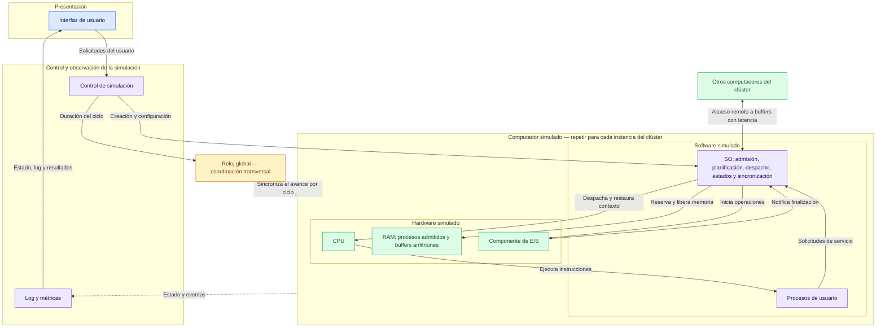

# ÁvilaOS — Diagrama de capas y responsabilidades

**Estado:** primer borrador para discusión del equipo. Representa responsabilidades y relaciones; no fija clases ni sustituye los UML de clases y secuencia. Construido a partir de la visión de capas discutida por el estudiante.

## Cómo leerlo

- Cada computador tiene su CPU, RAM, SO y procesos. El recuadro representa una instancia repetible; el clúster contiene al menos dos.
- Las flechas indican relaciones o mensajes, no un orden temporal ni necesariamente dependencias entre clases. No es una arquitectura de capas estrictas donde cada caja sólo pueda conocer la inmediata inferior.
- El reloj es global y transversal: coordina los ciclos, pero no elige procesos ni decide bloqueos. Su conexión al recuadro evita fijar todavía cómo se distribuye cada pulso internamente.
- Los procesos representan la carga de usuario. El SO administra esa carga; la CPU ejecuta las instrucciones simuladas, incluidas las que corresponden a modo SO. No se exige una clase Java por caja.
- El componente de E/S conserva el progreso de las operaciones y notifica su finalización. El SO modifica estados y decide el despacho. Llamarlo DMA explícitamente queda pendiente de la aclaración del enunciado.
- Los buffers residen en la RAM de su anfitrión. El SO coordina su acceso mediante semáforos. La conexión entre computadores representa comunicación simulada, no obliga a implementar una red real.
- Log y métricas reciben información de lo ocurrido; no deciden admisión, planificación ni sincronización. La flecha a la GUI agrupa la exposición del estado y los resultados sin fijar todavía el mecanismo de consulta.
- El control de simulación canaliza las acciones de la GUI. Las decisiones propias del SO permanecen en el SO simulado.
- Suspensión, disco y memoria virtual quedan para la extensión del Proyecto 2; no se implementan por aparecer como posibilidad futura.

## Referencias

- [Mapa de requisitos](enunciado/INDICE.md).
- [Dudas y convenciones pendientes](enunciado/dudas-explicadas-proyecto-1.md).
- [Borrador previo de arquitectura por contratos](arquitectura-borrador.md): material para contrastar, no aprobación automática de todas sus cajas.
