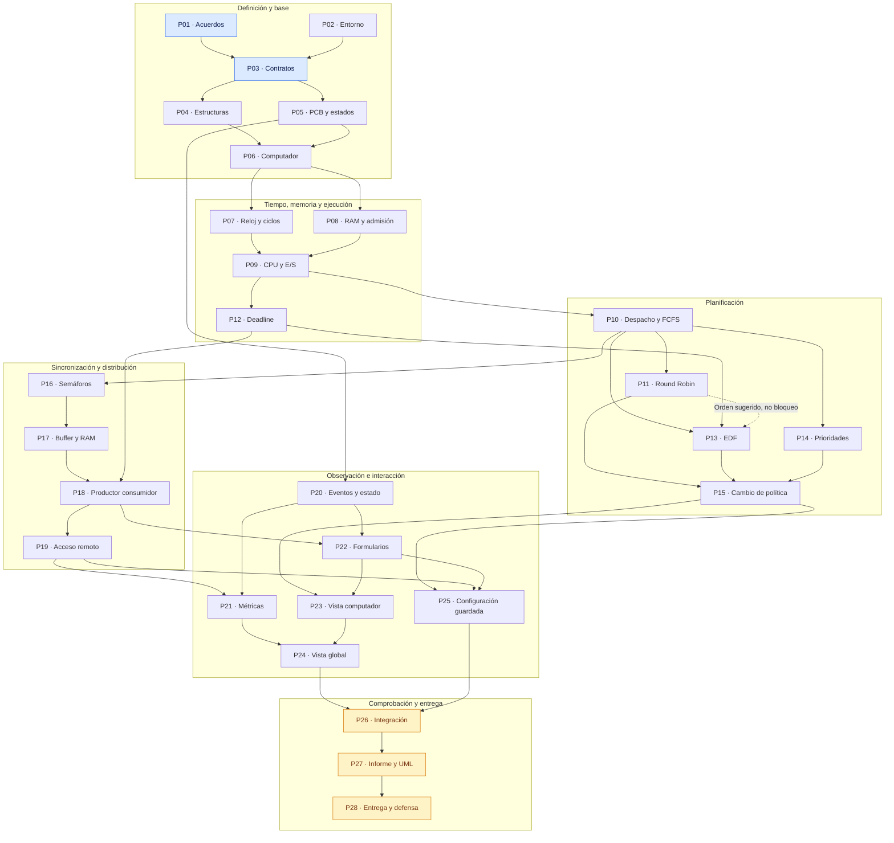

# ÁvilaOS — Mapa de desarrollo y diseño en dos niveles

**Estado:** propuesta para revisión del equipo, 02-10-2026. No es arquitectura aprobada, no crea Issues/PRs y no autoriza implementación por encima de funciones. Ares recibió la consulta, pero sus respuestas no están incorporadas todavía.

**Nivel 1:** paquetes con un resultado revisable, aproximadamente un PR. **Nivel 2:** cada paquete abre su mapa y texto de los requisitos atómicos asociados. Los nombres P01–P28 son etiquetas de planificación, no números reales de Pull Requests.

El [checklist original](../enunciado/checklist-requerimientos-proyecto-1.md) permanece intacto. Un paquete puede cubrir varios IDs; las obligaciones que se repiten durante el trabajo están en [transversales](transversales.md). Una asociación indica dónde se construirá la evidencia principal, no que el requisito ya esté cumplido.

## Leer el mapa

- **Flecha continua:** necesita el resultado del paquete anterior para integrar/cerrar su alcance en esta propuesta. No significa que nadie pueda preparar contratos, bocetos o pruebas antes.
- **Flecha punteada entre paquetes:** orden práctico sugerido; no bloquea. Es una preferencia, no una dependencia técnica.
- **Recuadros grandes:** familias para localizar paquetes, no nuevas capas de software ni obligación de terminarlos en serie.
- En cada detalle, las líneas entre un paquete y IDs expresan pertenencia, **no** dependencias entre los requisitos atómicos.
- Las dependencias son una propuesta del equipo de planificación, no nuevas reglas del enunciado. Cada ficha explica su resultado y comprobación; se ajustan al revisar los contratos.

## Nivel 1 — Paquetes y dependencias

## Abrir el nivel 2

| Paquete | Resultado del PR aproximado | Tipo | IDs propios | Depende de | Dudas aplicables |
|---|---|---|---:|---|---|
| [P01](paquetes/P01.md) | Acordar reglas y recorridos | Definición | 0 | — | D-01, D-04, D-05, D-06, D-07, D-09, D-11, D-16 |
| [P02](paquetes/P02.md) | Entorno Java y NetBeans | Preparación | 4 | — | — |
| [P03](paquetes/P03.md) | Definir contratos y tipos comunes | Diseño | 11 | P01, P02 | D-03, D-04, D-05, D-16 |
| [P04](paquetes/P04.md) | Estructuras propias y acceso seguro | Implementación | 2 | P02, P03 | — |
| [P05](paquetes/P05.md) | Proceso, PCB y estados | Implementación | 20 | P03 | D-03, D-07 |
| [P06](paquetes/P06.md) | Computador reutilizable | Implementación | 9 | P04, P05 | — |
| [P07](paquetes/P07.md) | Reloj global y avance por ciclo | Implementación | 8 | P06 | D-04 |
| [P08](paquetes/P08.md) | Admisión y liberación de RAM | Implementación | 9 | P06 | D-08, D-12 |
| [P09](paquetes/P09.md) | Ejecución CPU y espera de E/S | Implementación | 4 | P07, P08 | D-04, D-05, D-16 |
| [P10](paquetes/P10.md) | Despacho y política FCFS | Implementación | 4 | P09 | D-01 |
| [P11](paquetes/P11.md) | Round Robin y quantum | Implementación | 3 | P10 | D-01, D-04, D-10 |
| [P12](paquetes/P12.md) | Deadline y terminación forzada | Implementación | 1 | P09 | D-07, D-13 |
| [P13](paquetes/P13.md) | Política EDF | Implementación | 1 | P10, P12 | D-01, D-07 |
| [P14](paquetes/P14.md) | Prioridades apropiativas | Implementación | 1 | P10 | D-01 |
| [P15](paquetes/P15.md) | Cambio de política por computador | Implementación | 2 | P11, P13, P14 | D-01, D-10 |
| [P16](paquetes/P16.md) | Primitivas de semáforo y bloqueo | Implementación | 10 | P10 | D-03, D-04, D-13 |
| [P17](paquetes/P17.md) | Buffer acotado residente | Implementación | 13 | P08, P16 | D-08 |
| [P18](paquetes/P18.md) | Productores y consumidores locales | Implementación | 28 | P17, P12 | D-04, D-06, D-13 |
| [P19](paquetes/P19.md) | Acceso remoto con latencia | Implementación | 4 | P18 | D-11, D-13 |
| [P20](paquetes/P20.md) | Eventos y estado observable | Implementación | 2 | P03, P05 | D-09 |
| [P21](paquetes/P21.md) | Métricas locales y globales | Implementación | 13 | P12, P19, P20 | D-07, D-09 |
| [P22](paquetes/P22.md) | Formularios y comandos del usuario | Implementación | 11 | P18, P20 | D-02, D-05, D-06, D-08 |
| [P23](paquetes/P23.md) | Vista por computador | Implementación | 20 | P15, P20, P22 | — |
| [P24](paquetes/P24.md) | Vista global y gráfico | Implementación | 6 | P19, P21, P23 | — |
| [P25](paquetes/P25.md) | Guardar y cargar configuración | Implementación | 11 | P15, P19, P22 | D-05, D-06, D-07, D-08 |
| [P26](paquetes/P26.md) | Integración y comprobación de requisitos | Verificación | 1 | P24, P25 | D-01, D-04, D-05, D-06, D-07, D-08, D-09, D-10, D-11, D-12, D-13, D-16 |
| [P27](paquetes/P27.md) | Informe y diagramas finales | Documentación | 9 | P26 | D-14 |
| [P28](paquetes/P28.md) | Entrega y preparación de defensa | Cierre | 10 | P27 | D-15 |

## Orden sugerido para arrancar

1. **Hoy:** revisar P01/P03 con el diagrama de capas y los recorridos que ya explicó el estudiante. Mantener abiertas las convenciones pendientes de Ares. Inspeccionar el proyecto Java existente para P02.
2. **Base mínima:** acordar y construir las estructuras y el PCB; ensamblar el computador. Probar dos instancias sin mezclar sus estados.
3. **Primer recorrido completo:** reloj + admisión + CPU/E/S + despacho FCFS. Conseguir crear, admitir, ejecutar, bloquear, despertar y terminar antes de multiplicar políticas.
4. **Trabajo en paralelo después del despacho común:** RR, prioridades, deadline/EDF y primitivas de semáforo pueden repartirse si sus contratos están estables. Registrar eventos desde temprano.
5. **Extender casos:** buffers y productor–consumidor local; después acceso remoto. Terminar de integrar cambios de políticas, vistas, métricas y configuración guardada.
6. **Cerrar con evidencia:** integración, informe/diagramas consistentes y defensa. Documentar y comprobar desde cada PR; estas últimas tareas consolidan.

**El número no es un calendario:** P20 puede empezar mucho antes que P19. Las flechas y contratos determinan qué necesita cada uno. El diseño visual puede adelantarse usando datos de ejemplo, pero su PR no se da por integrado hasta que conecte con el comportamiento real.

## Qué puede avanzar en paralelo

| Momento | Frentes posibles | Límite |
|---|---|---|
| Inicio | Aclaraciones/recorridos y entorno | No convertir decisiones pendientes en hechos |
| Contratos disponibles | Estructuras, datos del PCB, formato de eventos y bocetos de GUI | Pactar contratos antes de editar superficies compartidas |
| Computador base | Tiempo y memoria | Acordar cuándo una transición se hace visible por ciclo |
| Despacho base | RR, prioridades, deadline y semáforos | EDF necesita además la regla común de deadline; no duplicarla |
| Semáforos y RAM | Buffers; política en ejecución puede avanzar aparte | Buffers consumen la misma RAM que admite procesos |
| Productor–consumidor local | Remoto; formularios y persistencia con contratos estables | Integrar cancelación consistente por deadline |
| Eventos definidos | Fórmulas de métricas y vistas con trazas | La aceptación integrada exige eventos reales, no sólo ejemplos |

## Decisiones pendientes: no bloquear todo

**Estado de P01:** base estructural cerrada por César el 03-10-2026; [clasificación de acuerdos](p01-base-estructural.md). Incluye relación directa con requisitos originales y separa pendientes de comportamiento e implementación; no exige cerrar todas las A para avanzar.

Para trabajar P01: [comparación de alternativas para 35 decisiones concretas](p01-alternativas.md). Incluye alternativas y acuerdos registrados. Es un catálogo consultable por paquete, no 35 decisiones obligatorias antes de programar; su clasificación distingue alcance estructural, contratos y detalles a resolver al implementar cada parte.

D-01 afecta el conjunto de políticas. D-04/05/06/07/11/16 afectan contratos de ejecución. D-08/10/12/13 requieren convenciones explícitas para casos límite. D-09 afecta cálculos; D-14/15 corresponden a cierre y entrega. La tabla y las fichas muestran a quién afecta cada una.

P01 no necesita esperar todas las respuestas: entrega lo revisado y registra lo abierto. Un paquete afectado puede explorar alternativas, pero no cerrarse sobre un supuesto oculto. Registrar luego la respuesta de Ares o la decisión aceptada del equipo, manteniendo el checklist sin cambios.

## Tamaño y cierre de PR

Los 28 paquetes son una primera partición, **no una promesa de 28 PR exactos**. P18 es el más amplio; si el protocolo no cabe en una revisión clara, dividirlo sin perder la comprobación conjunta. P28 incluye acciones de entrega/defensa que no son commits. P01 y P03 pueden ser PRs de documentación y contratos.

Antes de implementar cada parte, completar con el estudiante su mapa de función. El resultado de un PR debe poder explicarse y verificarse. Cuando termine la revisión, se pueden convertir estos paquetes en Issues sin reinterpretar ni volver a numerar los IDs del checklist.

## Cobertura y mantenimiento

- [Tabla inversa: ID del checklist → paquete o transversal](trazabilidad.md).
- [Reglas transversales](transversales.md).
- [Datos del mapa](mapa.json), para comprobar cobertura y dependencias.
- [Validación reproducible](validar_mapa.py): ejecutar `python3 docs/plan-desarrollo/validar_mapa.py` desde la raíz del repositorio.

Este mapa no cambia la implementación, no crea arquitectura ejecutable y no modifica el checklist. Si se divide un paquete, actualizar asociaciones y dependencias y repetir la validación. Las exclusiones, recomendaciones y consecuencias de evaluación siguen enlazadas desde el checklist; no se convierten en requisitos nuevos.
