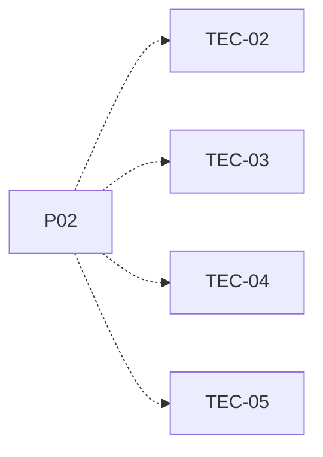

# P02 — Entorno Java y NetBeans

[Volver al mapa](../README.md) · **Tipo:** Preparación · **Estado:** propuesta sin aprobación ni implementación comprobada.

## Resultado revisable del paquete

Proyecto mínimo reproducible que abre y ejecuta en NetBeans con la versión Java acordada conforme al enunciado. Instrucciones de arranque.

## Dependencias de integración

Ningún paquete previo.

Necesitar esos resultados no impide preparar un boceto, un contrato o casos de prueba antes. No usar mocks como evidencia de integración real.

**Decisiones que condicionan este paquete:** Ninguna D-xx identificada específicamente.

Consultar [las dudas explicadas](../../enunciado/dudas-explicadas-proyecto-1.md); este mapa no supone que Ares ya las respondió.

## Qué comprobar al revisar

Otro integrante abre la misma revisión y ejecuta el proyecto. Inspeccionar primero el proyecto Java existente; no recrearlo ni sobrescribirlo por defecto.

## Nivel 2 — Requisitos atómicos asociados

Las líneas del mapa siguiente significan **pertenencia al paquete**, no orden entre requisitos. Los textos completos se conservan debajo para no perder el detalle.

| ID del checklist | Requisito original |
|---|---|
| [TEC-02](../../enunciado/checklist-requerimientos-proyecto-1.md#tec--equipo-tecnología-y-restricciones) | Desarrollar el proyecto en Java. |
| [TEC-03](../../enunciado/checklist-requerimientos-proyecto-1.md#tec--equipo-tecnología-y-restricciones) | Usar una versión posterior a Java 21, según la redacción literal del enunciado. |
| [TEC-04](../../enunciado/checklist-requerimientos-proyecto-1.md#tec--equipo-tecnología-y-restricciones) | Usar NetBeans como IDE requerido. |
| [TEC-05](../../enunciado/checklist-requerimientos-proyecto-1.md#tec--equipo-tecnología-y-restricciones) | Garantizar la ejecución adecuada del proyecto en NetBeans. |

## Reglas transversales

Aplicar [Git, restricciones y calidad](../transversales.md) según el tipo de cambio. Antes de código sustancial, el estudiante define y explica el mapa de cada función: responsabilidad, entradas, salidas, estado/efectos, conexiones, condiciones, iteraciones/terminación y casos normal/error. Esta ficha no sustituye ese trabajo ni autoriza implementación autónoma.
