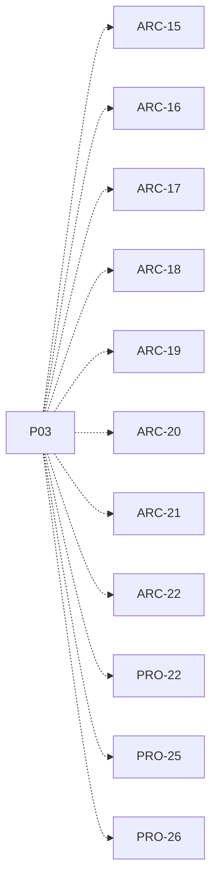

# P03 — Definir contratos y tipos comunes

[Volver al mapa](../README.md) · **Tipo:** Diseño · **Estado:** propuesta sin aprobación ni implementación comprobada.

## Resultado revisable del paquete

Contratos revisados para las responsabilidades del diagrama de capas; enumeraciones e interfaces mínimas, con entradas, salidas, estado y conexiones. La relación proceso/hilo se explica sin imponer una clase por responsabilidad.

## Dependencias de integración

[P01 — Acordar reglas y recorridos](P01.md); [P02 — Entorno Java y NetBeans](P02.md)

Necesitar esos resultados no impide preparar un boceto, un contrato o casos de prueba antes. No usar mocks como evidencia de integración real.

**Decisiones que condicionan este paquete:** D-03, D-04, D-05, D-16

Consultar [las dudas explicadas](../../enunciado/dudas-explicadas-proyecto-1.md); este mapa no supone que Ares ya las respondió.

## Qué comprobar al revisar

Los integrantes explican las interfaces y cómo agregar una política sin cambiar el selector. Cada firma propuesta tiene finalidad y consumidores conocidos.

## Alcance y advertencias de planificación

No diseña automáticamente todo el producto. Completar activamente con el estudiante los mapas de función que exige AGENTS.md antes de implementar. Los contratos pueden refinarse en paquetes posteriores.

## Nivel 2 — Requisitos atómicos asociados

Las líneas del mapa siguiente significan **pertenencia al paquete**, no orden entre requisitos. Los textos completos se conservan debajo para no perder el detalle.

| ID del checklist | Requisito original |
|---|---|
| [ARC-15](../../enunciado/checklist-requerimientos-proyecto-1.md#arc--arquitectura-diseño-y-reloj) | Modelar la solución de forma estructurada y orientada a objetos. |
| [ARC-16](../../enunciado/checklist-requerimientos-proyecto-1.md#arc--arquitectura-diseño-y-reloj) | Representar los estados de proceso mediante un enum. |
| [ARC-17](../../enunciado/checklist-requerimientos-proyecto-1.md#arc--arquitectura-diseño-y-reloj) | Representar los tipos de proceso mediante un enum —exigido en el planteamiento, aunque no se repita en la lista mínima de RF §1—. |
| [ARC-18](../../enunciado/checklist-requerimientos-proyecto-1.md#arc--arquitectura-diseño-y-reloj) | Representar las políticas de planificación mediante un enum. |
| [ARC-19](../../enunciado/checklist-requerimientos-proyecto-1.md#arc--arquitectura-diseño-y-reloj) | Representar el modo del procesador —usuario o sistema operativo— mediante un enum. |
| [ARC-20](../../enunciado/checklist-requerimientos-proyecto-1.md#arc--arquitectura-diseño-y-reloj) | Definir el comportamiento de las políticas de planificación mediante una interfaz. |
| [ARC-21](../../enunciado/checklist-requerimientos-proyecto-1.md#arc--arquitectura-diseño-y-reloj) | Permitir agregar una política implementando/extendiéndose sobre esa abstracción, sin modificar el código del planificador. |
| [ARC-22](../../enunciado/checklist-requerimientos-proyecto-1.md#arc--arquitectura-diseño-y-reloj) | Definir una interfaz común para los componentes que reaccionan al reloj, como CPU y DMA cuando corresponda. |
| [PRO-22](../../enunciado/checklist-requerimientos-proyecto-1.md#pro--creación-y-modelo-de-procesos) | Modelar un único hilo de ejecución por proceso simulado. |
| [PRO-25](../../enunciado/checklist-requerimientos-proyecto-1.md#pro--creación-y-modelo-de-procesos) | Asignar al procesador el proceso —equivalente a su único hilo— como unidad de planificación. |
| [PRO-26](../../enunciado/checklist-requerimientos-proyecto-1.md#pro--creación-y-modelo-de-procesos) | Integrar el TCB en el PCB o mantener una asociación 1:1 entre ambos; no exige dos clases separadas. |

## Reglas transversales

Aplicar [Git, restricciones y calidad](../transversales.md) según el tipo de cambio. Antes de código sustancial, el estudiante define y explica el mapa de cada función: responsabilidad, entradas, salidas, estado/efectos, conexiones, condiciones, iteraciones/terminación y casos normal/error. Esta ficha no sustituye ese trabajo ni autoriza implementación autónoma.
