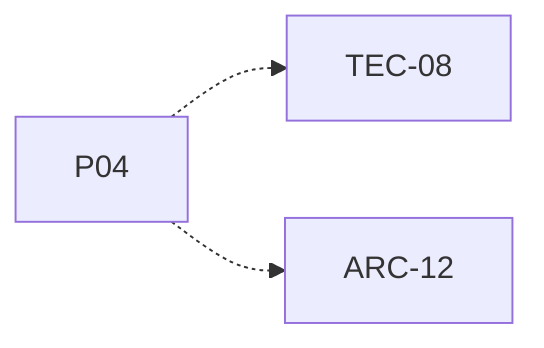

# P04 — Estructuras propias y acceso seguro

[Volver al mapa](../README.md) · **Tipo:** Implementación · **Estado:** propuesta sin aprobación ni implementación comprobada.

## Resultado revisable del paquete

Operaciones necesarias de las estructuras propias elegidas por el equipo y protección de accesos compartidos entre threads Java mediante semáforos.

## Dependencias de integración

[P02 — Entorno Java y NetBeans](P02.md); [P03 — Definir contratos y tipos comunes](P03.md)

Necesitar esos resultados no impide preparar un boceto, un contrato o casos de prueba antes. No usar mocks como evidencia de integración real.

**Decisiones que condicionan este paquete:** Ninguna D-xx identificada específicamente.

Consultar [las dudas explicadas](../../enunciado/dudas-explicadas-proyecto-1.md); este mapa no supone que Ares ya las respondió.

## Qué comprobar al revisar

Insertar, extraer, buscar y recorrer con casos vacío/uno/varios; comprobar conservación de elementos bajo concurrencia cuando aplique.

## Alcance y advertencias de planificación

Construir sólo las estructuras justificadas por los contratos. No implementar un framework genérico. Si las estructuras elegidas resultan muchas, dividir este paquete preservando la trazabilidad.

## Nivel 2 — Requisitos atómicos asociados

Las líneas del mapa siguiente significan **pertenencia al paquete**, no orden entre requisitos. Los textos completos se conservan debajo para no perder el detalle.

| ID del checklist | Requisito original |
|---|---|
| [TEC-08](../../enunciado/checklist-requerimientos-proyecto-1.md#tec--equipo-tecnología-y-restricciones) | Programar estructuras de datos propias para gestionar procesos y PCBs. |
| [ARC-12](../../enunciado/checklist-requerimientos-proyecto-1.md#arc--arquitectura-diseño-y-reloj) | Usar semáforos de Java para garantizar exclusión mutua sobre las estructuras compartidas entre threads reales. |

## Reglas transversales

Aplicar [Git, restricciones y calidad](../transversales.md) según el tipo de cambio. Antes de código sustancial, el estudiante define y explica el mapa de cada función: responsabilidad, entradas, salidas, estado/efectos, conexiones, condiciones, iteraciones/terminación y casos normal/error. Esta ficha no sustituye ese trabajo ni autoriza implementación autónoma.
