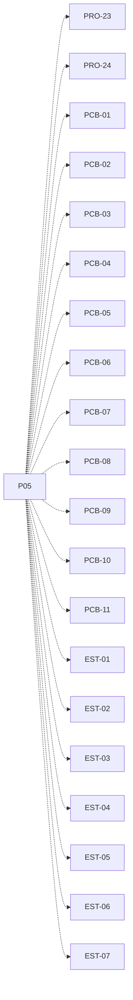

# P05 — Proceso, PCB y estados

[Volver al mapa](../README.md) · **Tipo:** Implementación · **Estado:** propuesta sin aprobación ni implementación comprobada.

## Resultado revisable del paquete

Representación y operaciones de creación/actualización de procesos, identidad única global, PCB y estado con motivo de bloqueo.

## Dependencias de integración

[P03 — Definir contratos y tipos comunes](P03.md)

Necesitar esos resultados no impide preparar un boceto, un contrato o casos de prueba antes. No usar mocks como evidencia de integración real.

**Decisiones que condicionan este paquete:** D-03, D-07

Consultar [las dudas explicadas](../../enunciado/dudas-explicadas-proyecto-1.md); este mapa no supone que Ares ya las respondió.

## Qué comprobar al revisar

Crear procesos de dos computadores sin colisiones de ID; comprobar campos y estados. Todavía no exigir ejecución automática ni GUI.

## Nivel 2 — Requisitos atómicos asociados

Las líneas del mapa siguiente significan **pertenencia al paquete**, no orden entre requisitos. Los textos completos se conservan debajo para no perder el detalle.

| ID del checklist | Requisito original |
|---|---|
| [PRO-23](../../enunciado/checklist-requerimientos-proyecto-1.md#pro--creación-y-modelo-de-procesos) | Conservar el contador de programa propio de cada proceso. |
| [PRO-24](../../enunciado/checklist-requerimientos-proyecto-1.md#pro--creación-y-modelo-de-procesos) | Mantener los recursos de memoria propios de cada proceso. |
| [PCB-01](../../enunciado/checklist-requerimientos-proyecto-1.md#pcb--campos-mínimos-del-bloque-de-control) | Incluir el ID del proceso en su PCB. |
| [PCB-02](../../enunciado/checklist-requerimientos-proyecto-1.md#pcb--campos-mínimos-del-bloque-de-control) | Generar dinámicamente el ID de cada proceso. |
| [PCB-03](../../enunciado/checklist-requerimientos-proyecto-1.md#pcb--campos-mínimos-del-bloque-de-control) | Garantizar que el ID sea único en todo el sistema distribuido. |
| [PCB-04](../../enunciado/checklist-requerimientos-proyecto-1.md#pcb--campos-mínimos-del-bloque-de-control) | Incluir el nombre del proceso en su PCB. |
| [PCB-05](../../enunciado/checklist-requerimientos-proyecto-1.md#pcb--campos-mínimos-del-bloque-de-control) | Incluir el computador en el que se ejecuta el proceso en su PCB. |
| [PCB-06](../../enunciado/checklist-requerimientos-proyecto-1.md#pcb--campos-mínimos-del-bloque-de-control) | Incluir el estado del proceso en su PCB. |
| [PCB-07](../../enunciado/checklist-requerimientos-proyecto-1.md#pcb--campos-mínimos-del-bloque-de-control) | Incluir el tipo del proceso en su PCB. |
| [PCB-08](../../enunciado/checklist-requerimientos-proyecto-1.md#pcb--campos-mínimos-del-bloque-de-control) | Incluir la prioridad del proceso en su PCB. |
| [PCB-09](../../enunciado/checklist-requerimientos-proyecto-1.md#pcb--campos-mínimos-del-bloque-de-control) | Incluir la memoria asignada al proceso en su PCB. |
| [PCB-10](../../enunciado/checklist-requerimientos-proyecto-1.md#pcb--campos-mínimos-del-bloque-de-control) | Incluir el deadline del proceso en su PCB. |
| [PCB-11](../../enunciado/checklist-requerimientos-proyecto-1.md#pcb--campos-mínimos-del-bloque-de-control) | Incluir el tiempo restante de ejecución del proceso en su PCB. |
| [EST-01](../../enunciado/checklist-requerimientos-proyecto-1.md#est--estados-y-terminación) | Incluir el estado Nuevo en el modelo de procesos. |
| [EST-02](../../enunciado/checklist-requerimientos-proyecto-1.md#est--estados-y-terminación) | Incluir el estado Listo en el modelo de procesos. |
| [EST-03](../../enunciado/checklist-requerimientos-proyecto-1.md#est--estados-y-terminación) | Incluir el estado Ejecución en el modelo de procesos. |
| [EST-04](../../enunciado/checklist-requerimientos-proyecto-1.md#est--estados-y-terminación) | Incluir el estado Bloqueado en el modelo de procesos. |
| [EST-05](../../enunciado/checklist-requerimientos-proyecto-1.md#est--estados-y-terminación) | Incluir el estado Terminado en el modelo de procesos. |
| [EST-06](../../enunciado/checklist-requerimientos-proyecto-1.md#est--estados-y-terminación) | Identificar las variantes o motivos de bloqueo que se implementarán; ver D-03 sobre la redacción de estados bloqueados. |
| [EST-07](../../enunciado/checklist-requerimientos-proyecto-1.md#est--estados-y-terminación) | Justificar las variantes o motivos de bloqueo implementados. |

## Reglas transversales

Aplicar [Git, restricciones y calidad](../transversales.md) según el tipo de cambio. Antes de código sustancial, el estudiante define y explica el mapa de cada función: responsabilidad, entradas, salidas, estado/efectos, conexiones, condiciones, iteraciones/terminación y casos normal/error. Esta ficha no sustituye ese trabajo ni autoriza implementación autónoma.
