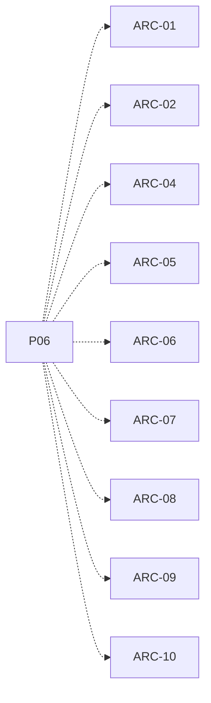

# P06 — Computador reutilizable

[Volver al mapa](../README.md) · **Tipo:** Implementación · **Estado:** propuesta sin aprobación ni implementación comprobada.

## Resultado revisable del paquete

Una unidad computador instanciable con CPU, RAM y responsabilidades de SO/colas propias, conectada mediante los contratos revisados.

## Dependencias de integración

[P04 — Estructuras propias y acceso seguro](P04.md); [P05 — Proceso, PCB y estados](P05.md)

Necesitar esos resultados no impide preparar un boceto, un contrato o casos de prueba antes. No usar mocks como evidencia de integración real.

**Decisiones que condicionan este paquete:** Ninguna D-xx identificada específicamente.

Consultar [las dudas explicadas](../../enunciado/dudas-explicadas-proyecto-1.md); este mapa no supone que Ares ya las respondió.

## Qué comprobar al revisar

Instanciar al menos dos computadores; cambiar el estado de uno no altera accidentalmente el otro. Agregar otro no duplica código.

## Alcance y advertencias de planificación

Es ensamblaje mínimo: no vuelve a implementar los algoritmos de paquetes posteriores ni presupone que todas las operaciones ya estén disponibles.

## Nivel 2 — Requisitos atómicos asociados

Las líneas del mapa siguiente significan **pertenencia al paquete**, no orden entre requisitos. Los textos completos se conservan debajo para no perder el detalle.

| ID del checklist | Requisito original |
|---|---|
| [ARC-01](../../enunciado/checklist-requerimientos-proyecto-1.md#arc--arquitectura-diseño-y-reloj) | Construir un simulador de ÁvilaOS, no un sistema operativo real. |
| [ARC-02](../../enunciado/checklist-requerimientos-proyecto-1.md#arc--arquitectura-diseño-y-reloj) | Soportar un clúster de al menos dos computadores simulados. |
| [ARC-04](../../enunciado/checklist-requerimientos-proyecto-1.md#arc--arquitectura-diseño-y-reloj) | Dotar a cada computador de su propia CPU simulada. |
| [ARC-05](../../enunciado/checklist-requerimientos-proyecto-1.md#arc--arquitectura-diseño-y-reloj) | Dotar a cada computador de su propia RAM simulada. |
| [ARC-06](../../enunciado/checklist-requerimientos-proyecto-1.md#arc--arquitectura-diseño-y-reloj) | Dotar a cada computador de su propio núcleo de sistema operativo. |
| [ARC-07](../../enunciado/checklist-requerimientos-proyecto-1.md#arc--arquitectura-diseño-y-reloj) | Dotar a cada computador de su propio planificador. |
| [ARC-08](../../enunciado/checklist-requerimientos-proyecto-1.md#arc--arquitectura-diseño-y-reloj) | Mantener las colas de procesos de cada computador separadas de las de los demás. |
| [ARC-09](../../enunciado/checklist-requerimientos-proyecto-1.md#arc--arquitectura-diseño-y-reloj) | Representar todos los computadores como instancias de una misma clase. |
| [ARC-10](../../enunciado/checklist-requerimientos-proyecto-1.md#arc--arquitectura-diseño-y-reloj) | Agregar computadores mediante nuevas instancias, sin duplicar el código del computador. |

## Reglas transversales

Aplicar [Git, restricciones y calidad](../transversales.md) según el tipo de cambio. Antes de código sustancial, el estudiante define y explica el mapa de cada función: responsabilidad, entradas, salidas, estado/efectos, conexiones, condiciones, iteraciones/terminación y casos normal/error. Esta ficha no sustituye ese trabajo ni autoriza implementación autónoma.
