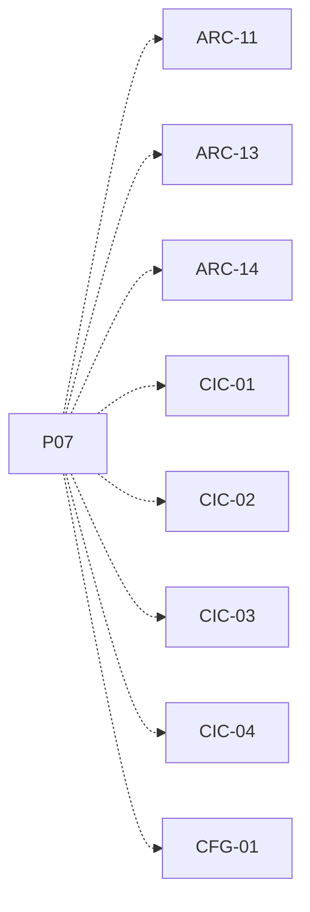

# P07 — Reloj global y avance por ciclo

[Volver al mapa](../README.md) · **Tipo:** Implementación · **Estado:** propuesta sin aprobación ni implementación comprobada.

## Resultado revisable del paquete

Coordinación por threads que hace avanzar una vez cada computador por ciclo; duración ajustable y reglas acordadas para PC/MAR y ejecución lineal.

## Dependencias de integración

[P06 — Computador reutilizable](P06.md)

Necesitar esos resultados no impide preparar un boceto, un contrato o casos de prueba antes. No usar mocks como evidencia de integración real.

**Decisiones que condicionan este paquete:** D-04

Consultar [las dudas explicadas](../../enunciado/dudas-explicadas-proyecto-1.md); este mapa no supone que Ares ya las respondió.

## Qué comprobar al revisar

Con dos computadores y una carga controlada, registrar N ciclos sin saltos ni dobles avances. Un proceso que espera no ejecuta instrucciones por recibir un pulso global.

## Alcance y advertencias de planificación

Primero usar una instrucción abstracta acordada; el generador de cargas CPU/E/S llega en P09. No exige fijar aquí una relación thread Java/proceso simulado no acordada.

## Nivel 2 — Requisitos atómicos asociados

Las líneas del mapa siguiente significan **pertenencia al paquete**, no orden entre requisitos. Los textos completos se conservan debajo para no perder el detalle.

| ID del checklist | Requisito original |
|---|---|
| [ARC-11](../../enunciado/checklist-requerimientos-proyecto-1.md#arc--arquitectura-diseño-y-reloj) | Usar threads de Java para la simulación. |
| [ARC-13](../../enunciado/checklist-requerimientos-proyecto-1.md#arc--arquitectura-diseño-y-reloj) | Disponer de un reloj global que sincronice todos los computadores. |
| [ARC-14](../../enunciado/checklist-requerimientos-proyecto-1.md#arc--arquitectura-diseño-y-reloj) | Hacer que cada computador avance exactamente un ciclo de ejecución por cada ciclo del reloj global. |
| [CIC-01](../../enunciado/checklist-requerimientos-proyecto-1.md#cic--reglas-de-ejecución-de-la-simulación) | Hacer que cada instrucción se ejecute en un único ciclo de instrucción. |
| [CIC-02](../../enunciado/checklist-requerimientos-proyecto-1.md#cic--reglas-de-ejecución-de-la-simulación) | Modelar la ejecución de los procesos de manera lineal. |
| [CIC-03](../../enunciado/checklist-requerimientos-proyecto-1.md#cic--reglas-de-ejecución-de-la-simulación) | Incrementar el PC en una unidad por ciclo según el supuesto del enunciado; ver D-04 sobre el proceso al que se aplica. |
| [CIC-04](../../enunciado/checklist-requerimientos-proyecto-1.md#cic--reglas-de-ejecución-de-la-simulación) | Incrementar el MAR en una unidad por ciclo según el supuesto del enunciado; ver D-04. |
| [CFG-01](../../enunciado/checklist-requerimientos-proyecto-1.md#cfg--configuración-y-persistencia) | Permitir cambiar durante la ejecución la duración de un ciclo, expresada en milisegundos o segundos. |

## Reglas transversales

Aplicar [Git, restricciones y calidad](../transversales.md) según el tipo de cambio. Antes de código sustancial, el estudiante define y explica el mapa de cada función: responsabilidad, entradas, salidas, estado/efectos, conexiones, condiciones, iteraciones/terminación y casos normal/error. Esta ficha no sustituye ese trabajo ni autoriza implementación autónoma.
