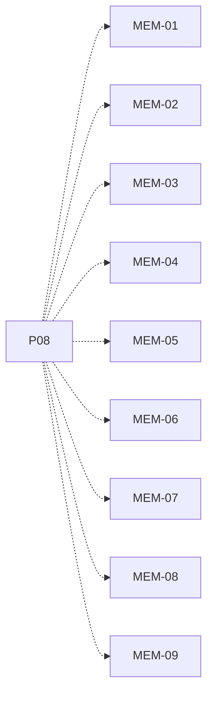

# P08 — Admisión y liberación de RAM

[Volver al mapa](../README.md) · **Tipo:** Implementación · **Estado:** propuesta sin aprobación ni implementación comprobada.

## Resultado revisable del paquete

Control de RAM limitada/configurable, reserva al admitir, permanencia en Nuevo y liberación/revisión de admisión al terminar.

## Dependencias de integración

[P06 — Computador reutilizable](P06.md)

Necesitar esos resultados no impide preparar un boceto, un contrato o casos de prueba antes. No usar mocks como evidencia de integración real.

**Decisiones que condicionan este paquete:** D-08, D-12

Consultar [las dudas explicadas](../../enunciado/dudas-explicadas-proyecto-1.md); este mapa no supone que Ares ya las respondió.

## Qué comprobar al revisar

Recorrer: cabe, no cabe, liberación que habilita uno y varios candidatos de distintos tamaños. Explicar la política de admisión elegida.

## Alcance y advertencias de planificación

La ocupación de buffers se conecta en P17 al mismo control de capacidad. No agregar suspensión, disco ni paginación.

## Nivel 2 — Requisitos atómicos asociados

Las líneas del mapa siguiente significan **pertenencia al paquete**, no orden entre requisitos. Los textos completos se conservan debajo para no perder el detalle.

| ID del checklist | Requisito original |
|---|---|
| [MEM-01](../../enunciado/checklist-requerimientos-proyecto-1.md#mem--admisión-y-memoria-principal) | Permitir configurar el tamaño de RAM de cada computador. |
| [MEM-02](../../enunciado/checklist-requerimientos-proyecto-1.md#mem--admisión-y-memoria-principal) | Representar la RAM de cada computador como una capacidad limitada. |
| [MEM-03](../../enunciado/checklist-requerimientos-proyecto-1.md#mem--admisión-y-memoria-principal) | Admitir un proceso de Nuevo a Listo sólo si dispone de suficiente RAM en el computador asignado. |
| [MEM-04](../../enunciado/checklist-requerimientos-proyecto-1.md#mem--admisión-y-memoria-principal) | Reservar la memoria requerida al admitir el proceso —consecuencia directa de contabilizar su ocupación y liberarla al terminar—. |
| [MEM-05](../../enunciado/checklist-requerimientos-proyecto-1.md#mem--admisión-y-memoria-principal) | Mantener en la cola de nuevos al proceso que no puede admitirse por falta de memoria. |
| [MEM-06](../../enunciado/checklist-requerimientos-proyecto-1.md#mem--admisión-y-memoria-principal) | Liberar la memoria del proceso cuando termina. |
| [MEM-07](../../enunciado/checklist-requerimientos-proyecto-1.md#mem--admisión-y-memoria-principal) | Revisar la cola de nuevos para admitir procesos después de liberar memoria por una terminación. |
| [MEM-08](../../enunciado/checklist-requerimientos-proyecto-1.md#mem--admisión-y-memoria-principal) | Controlar la cantidad de memoria usada de cada computador. |
| [MEM-09](../../enunciado/checklist-requerimientos-proyecto-1.md#mem--admisión-y-memoria-principal) | Controlar la cantidad de memoria libre de cada computador. |

## Reglas transversales

Aplicar [Git, restricciones y calidad](../transversales.md) según el tipo de cambio. Antes de código sustancial, el estudiante define y explica el mapa de cada función: responsabilidad, entradas, salidas, estado/efectos, conexiones, condiciones, iteraciones/terminación y casos normal/error. Esta ficha no sustituye ese trabajo ni autoriza implementación autónoma.
