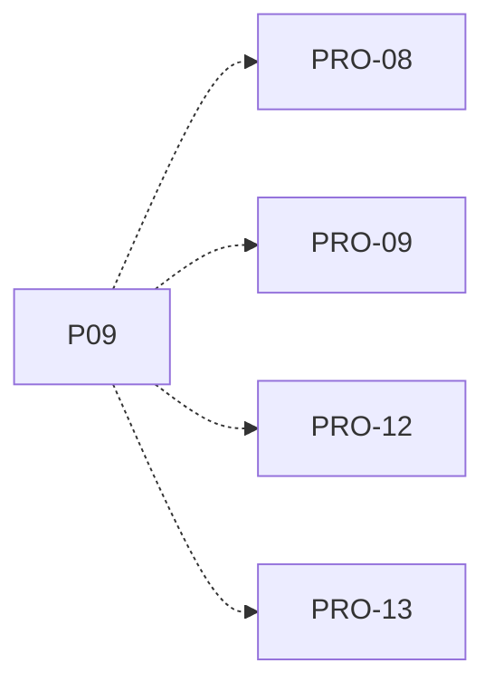

# P09 — Ejecución CPU y espera de E/S

[Volver al mapa](../README.md) · **Tipo:** Implementación · **Estado:** propuesta sin aprobación ni implementación comprobada.

## Resultado revisable del paquete

Cargas CPU bound e I/O bound con reglas explícitas para instrucciones, duración, solicitud de E/S, bloqueo, progreso y notificación de finalización.

## Dependencias de integración

[P07 — Reloj global y avance por ciclo](P07.md); [P08 — Admisión y liberación de RAM](P08.md)

Necesitar esos resultados no impide preparar un boceto, un contrato o casos de prueba antes. No usar mocks como evidencia de integración real.

**Decisiones que condicionan este paquete:** D-04, D-05, D-16

Consultar [las dudas explicadas](../../enunciado/dudas-explicadas-proyecto-1.md); este mapa no supone que Ares ya las respondió.

## Qué comprobar al revisar

P1 espera E/S mientras puede avanzar otra actividad; al concluir el evento P1 vuelve a Listo. No asumir que despertar implica ganar CPU.

## Alcance y advertencias de planificación

El nombre y detalle de DMA dependen de D-16. Probar inicialmente con una asignación controlada; P10 añade la política de selección.

## Nivel 2 — Requisitos atómicos asociados

Las líneas del mapa siguiente significan **pertenencia al paquete**, no orden entre requisitos. Los textos completos se conservan debajo para no perder el detalle.

| ID del checklist | Requisito original |
|---|---|
| [PRO-08](../../enunciado/checklist-requerimientos-proyecto-1.md#pro--creación-y-modelo-de-procesos) | Soportar procesos de tipo CPU bound. |
| [PRO-09](../../enunciado/checklist-requerimientos-proyecto-1.md#pro--creación-y-modelo-de-procesos) | Soportar procesos de tipo I/O bound. |
| [PRO-12](../../enunciado/checklist-requerimientos-proyecto-1.md#pro--creación-y-modelo-de-procesos) | Para un proceso CPU bound, permitir especificar los ciclos necesarios para satisfacerlo. |
| [PRO-13](../../enunciado/checklist-requerimientos-proyecto-1.md#pro--creación-y-modelo-de-procesos) | Para un proceso I/O bound, permitir especificar los ciclos necesarios para satisfacerlo. |

## Reglas transversales

Aplicar [Git, restricciones y calidad](../transversales.md) según el tipo de cambio. Antes de código sustancial, el estudiante define y explica el mapa de cada función: responsabilidad, entradas, salidas, estado/efectos, conexiones, condiciones, iteraciones/terminación y casos normal/error. Esta ficha no sustituye ese trabajo ni autoriza implementación autónoma.
