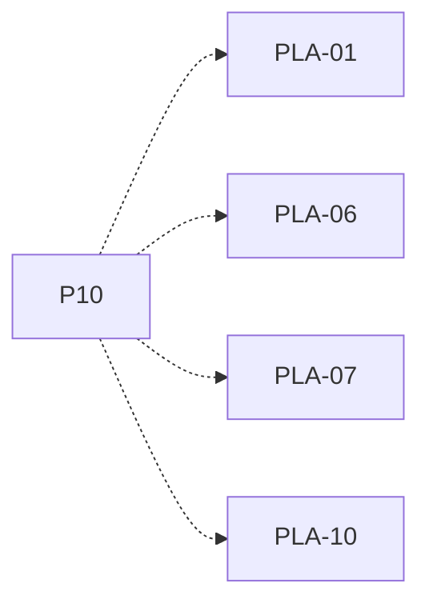

# P10 — Despacho y política FCFS

[Volver al mapa](../README.md) · **Tipo:** Implementación · **Estado:** propuesta sin aprobación ni implementación comprobada.

## Resultado revisable del paquete

Selección FCFS y despacho mediante el contrato común, cola única de listos y política propia por computador.

## Dependencias de integración

[P09 — Ejecución CPU y espera de E/S](P09.md)

Necesitar esos resultados no impide preparar un boceto, un contrato o casos de prueba antes. No usar mocks como evidencia de integración real.

**Decisiones que condicionan este paquete:** D-01

Consultar [las dudas explicadas](../../enunciado/dudas-explicadas-proyecto-1.md); este mapa no supone que Ares ya las respondió.

## Qué comprobar al revisar

Trazar selección, bloqueo, retorno y fin de procesos. Comprobar que FCFS no desaloja por llegada de otro listo.

## Alcance y advertencias de planificación

FCFS se propone como primera política por facilidad de verificación, no como dependencia matemática de RR/EDF/prioridades. Los siguientes paquetes reutilizan el mecanismo común de despacho, no la implementación de FCFS.

## Nivel 2 — Requisitos atómicos asociados

Las líneas del mapa siguiente significan **pertenencia al paquete**, no orden entre requisitos. Los textos completos se conservan debajo para no perder el detalle.

| ID del checklist | Requisito original |
|---|---|
| [PLA-01](../../enunciado/checklist-requerimientos-proyecto-1.md#pla--políticas-y-colas-de-planificación) | Implementar FCFS, política enumerada expresamente; su obligatoriedad individual queda sujeta a resolver D-01. |
| [PLA-06](../../enunciado/checklist-requerimientos-proyecto-1.md#pla--políticas-y-colas-de-planificación) | Programar el ordenamiento de la cola posterior a cada selección. |
| [PLA-07](../../enunciado/checklist-requerimientos-proyecto-1.md#pla--políticas-y-colas-de-planificación) | Mantener una política de planificación propia por computador. |
| [PLA-10](../../enunciado/checklist-requerimientos-proyecto-1.md#pla--políticas-y-colas-de-planificación) | Mantener una única cola de listos para el procesador de cada computador. |

## Reglas transversales

Aplicar [Git, restricciones y calidad](../transversales.md) según el tipo de cambio. Antes de código sustancial, el estudiante define y explica el mapa de cada función: responsabilidad, entradas, salidas, estado/efectos, conexiones, condiciones, iteraciones/terminación y casos normal/error. Esta ficha no sustituye ese trabajo ni autoriza implementación autónoma.
