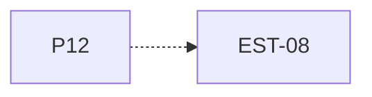

# P12 — Deadline y terminación forzada

[Volver al mapa](../README.md) · **Tipo:** Implementación · **Estado:** propuesta sin aprobación ni implementación comprobada.

## Resultado revisable del paquete

Regla común de avance de deadline y terminación por vencimiento, con retirada de la ubicación actual y liberación de RAM según contrato.

## Dependencias de integración

[P09 — Ejecución CPU y espera de E/S](P09.md)

Necesitar esos resultados no impide preparar un boceto, un contrato o casos de prueba antes. No usar mocks como evidencia de integración real.

**Decisiones que condicionan este paquete:** D-07, D-13

Consultar [las dudas explicadas](../../enunciado/dudas-explicadas-proyecto-1.md); este mapa no supone que Ares ya las respondió.

## Qué comprobar al revisar

Vencer en Nuevo, Listo, Ejecución y espera E/S; comprobar el caso de terminación justo en el límite conforme a D-07.

## Alcance y advertencias de planificación

D-13 define el contrato de limpieza ampliable. P18/P19 deben integrar cancelación de permisos y esperas de buffer/red; este paquete aislado no demuestra cumplimiento completo de EST-08 en esos escenarios futuros.

## Nivel 2 — Requisitos atómicos asociados

Las líneas del mapa siguiente significan **pertenencia al paquete**, no orden entre requisitos. Los textos completos se conservan debajo para no perder el detalle.

| ID del checklist | Requisito original |
|---|---|
| [EST-08](../../enunciado/checklist-requerimientos-proyecto-1.md#est--estados-y-terminación) | Terminar un proceso cuando su deadline llegue a cero. |

## Reglas transversales

Aplicar [Git, restricciones y calidad](../transversales.md) según el tipo de cambio. Antes de código sustancial, el estudiante define y explica el mapa de cada función: responsabilidad, entradas, salidas, estado/efectos, conexiones, condiciones, iteraciones/terminación y casos normal/error. Esta ficha no sustituye ese trabajo ni autoriza implementación autónoma.
