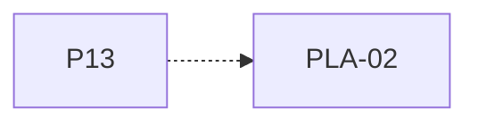

# P13 — Política EDF

[Volver al mapa](../README.md) · **Tipo:** Implementación · **Estado:** propuesta sin aprobación ni implementación comprobada.

## Resultado revisable del paquete

EDF sobre la semántica de deadline ya definida, con desempates y apropiación explicitados como decisiones del equipo o del preparador.

## Dependencias de integración

[P10 — Despacho y política FCFS](P10.md); [P12 — Deadline y terminación forzada](P12.md)

Necesitar esos resultados no impide preparar un boceto, un contrato o casos de prueba antes. No usar mocks como evidencia de integración real.

**Decisiones que condicionan este paquete:** D-01, D-07

Consultar [las dudas explicadas](../../enunciado/dudas-explicadas-proyecto-1.md); este mapa no supone que Ares ya las respondió.

## Qué comprobar al revisar

Comparar una traza manual con deadlines diferentes e iguales y con nuevas llegadas. No confundir prioridad EDF con el acto común de terminar por vencimiento.

## Nivel 2 — Requisitos atómicos asociados

Las líneas del mapa siguiente significan **pertenencia al paquete**, no orden entre requisitos. Los textos completos se conservan debajo para no perder el detalle.

| ID del checklist | Requisito original |
|---|---|
| [PLA-02](../../enunciado/checklist-requerimientos-proyecto-1.md#pla--políticas-y-colas-de-planificación) | Implementar EDF, política enumerada expresamente; su obligatoriedad individual queda sujeta a resolver D-01. |

## Reglas transversales

Aplicar [Git, restricciones y calidad](../transversales.md) según el tipo de cambio. Antes de código sustancial, el estudiante define y explica el mapa de cada función: responsabilidad, entradas, salidas, estado/efectos, conexiones, condiciones, iteraciones/terminación y casos normal/error. Esta ficha no sustituye ese trabajo ni autoriza implementación autónoma.
