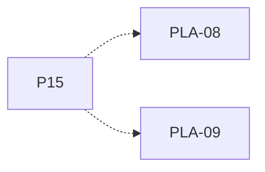

# P15 — Cambio de política por computador

[Volver al mapa](../README.md) · **Tipo:** Implementación · **Estado:** propuesta sin aprobación ni implementación comprobada.

## Resultado revisable del paquete

Cambio en ejecución que conserva los procesos y reorganiza lo necesario según reglas acordadas, independientemente en cada computador.

## Dependencias de integración

[P11 — Round Robin y quantum](P11.md); [P13 — Política EDF](P13.md); [P14 — Prioridades apropiativas](P14.md)

Necesitar esos resultados no impide preparar un boceto, un contrato o casos de prueba antes. No usar mocks como evidencia de integración real.

**Decisiones que condicionan este paquete:** D-01, D-10

Consultar [las dudas explicadas](../../enunciado/dudas-explicadas-proyecto-1.md); este mapa no supone que Ares ya las respondió.

## Qué comprobar al revisar

Cambiar entre políticas con un proceso ejecutando y otros listos; comprobar que no se pierden ni duplican y que otra máquina conserva su política.

## Alcance y advertencias de planificación

Si Ares autoriza sólo tres políticas, ajustar las dependencias y registrar el alcance aceptado. Este borrador conserva las cuatro enumeradas.

## Nivel 2 — Requisitos atómicos asociados

Las líneas del mapa siguiente significan **pertenencia al paquete**, no orden entre requisitos. Los textos completos se conservan debajo para no perder el detalle.

| ID del checklist | Requisito original |
|---|---|
| [PLA-08](../../enunciado/checklist-requerimientos-proyecto-1.md#pla--políticas-y-colas-de-planificación) | Permitir cambiar la política de un computador durante la ejecución. |
| [PLA-09](../../enunciado/checklist-requerimientos-proyecto-1.md#pla--políticas-y-colas-de-planificación) | Hacer que el cambio de política de un computador sea independiente de las políticas de los demás. |

## Reglas transversales

Aplicar [Git, restricciones y calidad](../transversales.md) según el tipo de cambio. Antes de código sustancial, el estudiante define y explica el mapa de cada función: responsabilidad, entradas, salidas, estado/efectos, conexiones, condiciones, iteraciones/terminación y casos normal/error. Esta ficha no sustituye ese trabajo ni autoriza implementación autónoma.
