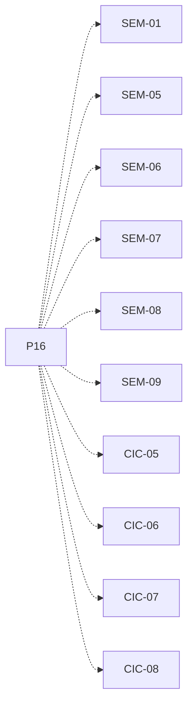

# P16 — Primitivas de semáforo y bloqueo

[Volver al mapa](../README.md) · **Tipo:** Implementación · **Estado:** propuesta sin aprobación ni implementación comprobada.

## Resultado revisable del paquete

Semáforos del modelo con wait/signal, espera y despertar, integración con el estado del proceso y costo de una instrucción en modo SO por primitiva.

## Dependencias de integración

[P10 — Despacho y política FCFS](P10.md)

Necesitar esos resultados no impide preparar un boceto, un contrato o casos de prueba antes. No usar mocks como evidencia de integración real.

**Decisiones que condicionan este paquete:** D-03, D-04, D-13

Consultar [las dudas explicadas](../../enunciado/dudas-explicadas-proyecto-1.md); este mapa no supone que Ares ya las respondió.

## Qué comprobar al revisar

Esperar sin permiso libera CPU; señalizar habilita al proceso correcto sin ejecutarlo automáticamente; reanudar no duplica la reserva.

## Alcance y advertencias de planificación

Estos semáforos del simulador son distintos de los semáforos Java que protegen sus estructuras. Su integración con cancelación debe respetar el contrato de P12.

## Nivel 2 — Requisitos atómicos asociados

Las líneas del mapa siguiente significan **pertenencia al paquete**, no orden entre requisitos. Los textos completos se conservan debajo para no perder el detalle.

| ID del checklist | Requisito original |
|---|---|
| [SEM-01](../../enunciado/checklist-requerimientos-proyecto-1.md#sem--semáforos-y-comportamiento-bloqueante) | Incluir semáforos como parte del modelo de ÁvilaOS; su implementación concreta queda a elección del equipo. |
| [SEM-05](../../enunciado/checklist-requerimientos-proyecto-1.md#sem--semáforos-y-comportamiento-bloqueante) | Bloquear al proceso que no puede entrar porque la región crítica está ocupada. |
| [SEM-06](../../enunciado/checklist-requerimientos-proyecto-1.md#sem--semáforos-y-comportamiento-bloqueante) | Hacer pasar a Bloqueado a quien ejecuta semWait sin un permiso disponible. |
| [SEM-07](../../enunciado/checklist-requerimientos-proyecto-1.md#sem--semáforos-y-comportamiento-bloqueante) | Encolar al proceso bloqueado por semWait en la cola del semáforo correspondiente. |
| [SEM-08](../../enunciado/checklist-requerimientos-proyecto-1.md#sem--semáforos-y-comportamiento-bloqueante) | Liberar la CPU cuando su proceso se bloquea por semWait. |
| [SEM-09](../../enunciado/checklist-requerimientos-proyecto-1.md#sem--semáforos-y-comportamiento-bloqueante) | Permitir que la CPU atienda a otro proceso elegible después de ese bloqueo. |
| [CIC-05](../../enunciado/checklist-requerimientos-proyecto-1.md#cic--reglas-de-ejecución-de-la-simulación) | Contabilizar cada semWait como una instrucción. |
| [CIC-06](../../enunciado/checklist-requerimientos-proyecto-1.md#cic--reglas-de-ejecución-de-la-simulación) | Ejecutar cada semWait en modo sistema operativo. |
| [CIC-07](../../enunciado/checklist-requerimientos-proyecto-1.md#cic--reglas-de-ejecución-de-la-simulación) | Contabilizar cada semSignal como una instrucción. |
| [CIC-08](../../enunciado/checklist-requerimientos-proyecto-1.md#cic--reglas-de-ejecución-de-la-simulación) | Ejecutar cada semSignal en modo sistema operativo. |

## Reglas transversales

Aplicar [Git, restricciones y calidad](../transversales.md) según el tipo de cambio. Antes de código sustancial, el estudiante define y explica el mapa de cada función: responsabilidad, entradas, salidas, estado/efectos, conexiones, condiciones, iteraciones/terminación y casos normal/error. Esta ficha no sustituye ese trabajo ni autoriza implementación autónoma.
