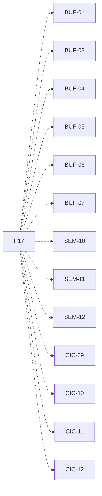

# P17 — Buffer acotado residente

[Volver al mapa](../README.md) · **Tipo:** Implementación · **Estado:** propuesta sin aprobación ni implementación comprobada.

## Resultado revisable del paquete

Buffer con capacidad, anfitrión y reserva de RAM, tres semáforos inicializados y operaciones de inserción/extracción con costo y modo acordados.

## Dependencias de integración

[P08 — Admisión y liberación de RAM](P08.md); [P16 — Primitivas de semáforo y bloqueo](P16.md)

Necesitar esos resultados no impide preparar un boceto, un contrato o casos de prueba antes. No usar mocks como evidencia de integración real.

**Decisiones que condicionan este paquete:** D-08

Consultar [las dudas explicadas](../../enunciado/dudas-explicadas-proyecto-1.md); este mapa no supone que Ares ya las respondió.

## Qué comprobar al revisar

Comprobar inicialización 1/0/capacidad, límites, ocupación en el anfitrión y rechazo o tratamiento de falta de RAM. El control de memoria es el mismo que usa P08.

## Nivel 2 — Requisitos atómicos asociados

Las líneas del mapa siguiente significan **pertenencia al paquete**, no orden entre requisitos. Los textos completos se conservan debajo para no perder el detalle.

| ID del checklist | Requisito original |
|---|---|
| [BUF-01](../../enunciado/checklist-requerimientos-proyecto-1.md#buf--buffers-distribución-y-latencia) | Permitir al usuario crear uno o más buffers. |
| [BUF-03](../../enunciado/checklist-requerimientos-proyecto-1.md#buf--buffers-distribución-y-latencia) | Permitir indicar la capacidad de cada buffer. |
| [BUF-04](../../enunciado/checklist-requerimientos-proyecto-1.md#buf--buffers-distribución-y-latencia) | Limitar los elementos almacenados a la capacidad del buffer. |
| [BUF-05](../../enunciado/checklist-requerimientos-proyecto-1.md#buf--buffers-distribución-y-latencia) | Permitir indicar el computador anfitrión de cada buffer. |
| [BUF-06](../../enunciado/checklist-requerimientos-proyecto-1.md#buf--buffers-distribución-y-latencia) | Ubicar cada buffer en la RAM de su computador anfitrión. |
| [BUF-07](../../enunciado/checklist-requerimientos-proyecto-1.md#buf--buffers-distribución-y-latencia) | Contabilizar el espacio del buffer como memoria ocupada de su anfitrión. |
| [SEM-10](../../enunciado/checklist-requerimientos-proyecto-1.md#sem--semáforos-y-comportamiento-bloqueante) | Disponer de un semáforo mutex s por buffer, inicializado en 1. |
| [SEM-11](../../enunciado/checklist-requerimientos-proyecto-1.md#sem--semáforos-y-comportamiento-bloqueante) | Disponer de un semáforo de elementos n por buffer, inicializado en 0. |
| [SEM-12](../../enunciado/checklist-requerimientos-proyecto-1.md#sem--semáforos-y-comportamiento-bloqueante) | Disponer de un semáforo de espacios e por buffer, inicializado con su capacidad. |
| [CIC-09](../../enunciado/checklist-requerimientos-proyecto-1.md#cic--reglas-de-ejecución-de-la-simulación) | Contabilizar cada inserción en un buffer como una instrucción. |
| [CIC-10](../../enunciado/checklist-requerimientos-proyecto-1.md#cic--reglas-de-ejecución-de-la-simulación) | Ejecutar cada inserción en un buffer en modo sistema operativo. |
| [CIC-11](../../enunciado/checklist-requerimientos-proyecto-1.md#cic--reglas-de-ejecución-de-la-simulación) | Contabilizar cada extracción de un buffer como una instrucción. |
| [CIC-12](../../enunciado/checklist-requerimientos-proyecto-1.md#cic--reglas-de-ejecución-de-la-simulación) | Ejecutar cada extracción de un buffer en modo sistema operativo. |

## Reglas transversales

Aplicar [Git, restricciones y calidad](../transversales.md) según el tipo de cambio. Antes de código sustancial, el estudiante define y explica el mapa de cada función: responsabilidad, entradas, salidas, estado/efectos, conexiones, condiciones, iteraciones/terminación y casos normal/error. Esta ficha no sustituye ese trabajo ni autoriza implementación autónoma.
