# P18 — Productores y consumidores locales

[Volver al mapa](../README.md) · **Tipo:** Implementación · **Estado:** propuesta sin aprobación ni implementación comprobada.

## Resultado revisable del paquete

Ciclo productor/consumidor local, parámetros de trabajo, varios participantes y protocolo completo con bloqueo por lleno/vacío/mutex.

## Dependencias de integración

[P17 — Buffer acotado residente](P17.md); [P12 — Deadline y terminación forzada](P12.md)

Necesitar esos resultados no impide preparar un boceto, un contrato o casos de prueba antes. No usar mocks como evidencia de integración real.

**Decisiones que condicionan este paquete:** D-04, D-06, D-13

Consultar [las dudas explicadas](../../enunciado/dudas-explicadas-proyecto-1.md); este mapa no supone que Ares ya las respondió.

## Qué comprobar al revisar

Recorrer buffer vacío, lleno, múltiples participantes, finalización normal y deadline en distintas etapas de reserva/inserción/extracción; no perder permisos.

## Alcance y advertencias de planificación

Es el paquete más amplio por la integración del protocolo. Si no cabe en un PR revisable, partirlo en productor y consumidor manteniendo una aceptación conjunta del protocolo. No cambiar el checklist.

## Nivel 2 — Requisitos atómicos asociados

Las líneas del mapa siguiente significan **pertenencia al paquete**, no orden entre requisitos. Los textos completos se conservan debajo para no perder el detalle.

```mermaid
flowchart LR
    paquete["P18"]
    PRO10["PRO-10"]
    paquete -.-> PRO10
    PRO11["PRO-11"]
    paquete -.-> PRO11
    PRO14["PRO-14"]
    paquete -.-> PRO14
    PRO15["PRO-15"]
    paquete -.-> PRO15
    PRO16["PRO-16"]
    paquete -.-> PRO16
    PRO17["PRO-17"]
    paquete -.-> PRO17
    PRO18["PRO-18"]
    paquete -.-> PRO18
    PRO19["PRO-19"]
    paquete -.-> PRO19
    BUF08["BUF-08"]
    paquete -.-> BUF08
    BUF09["BUF-09"]
    paquete -.-> BUF09
    BUF10["BUF-10"]
    paquete -.-> BUF10
    BUF11["BUF-11"]
    paquete -.-> BUF11
    SEM02["SEM-02"]
    paquete -.-> SEM02
    SEM03["SEM-03"]
    paquete -.-> SEM03
    SEM04["SEM-04"]
    paquete -.-> SEM04
    SEM13["SEM-13"]
    paquete -.-> SEM13
    SEM14["SEM-14"]
    paquete -.-> SEM14
    SEM15["SEM-15"]
    paquete -.-> SEM15
    SEM16["SEM-16"]
    paquete -.-> SEM16
    SEM17["SEM-17"]
    paquete -.-> SEM17
    SEM18["SEM-18"]
    paquete -.-> SEM18
    SEM19["SEM-19"]
    paquete -.-> SEM19
    SEM20["SEM-20"]
    paquete -.-> SEM20
    SEM21["SEM-21"]
    paquete -.-> SEM21
    SEM22["SEM-22"]
    paquete -.-> SEM22
    SEM23["SEM-23"]
    paquete -.-> SEM23
    SEM24["SEM-24"]
    paquete -.-> SEM24
    SEM25["SEM-25"]
    paquete -.-> SEM25
```

| ID del checklist | Requisito original |
|---|---|
| [PRO-10](../../enunciado/checklist-requerimientos-proyecto-1.md#pro--creación-y-modelo-de-procesos) | Soportar procesos de tipo productor. |
| [PRO-11](../../enunciado/checklist-requerimientos-proyecto-1.md#pro--creación-y-modelo-de-procesos) | Soportar procesos de tipo consumidor. |
| [PRO-14](../../enunciado/checklist-requerimientos-proyecto-1.md#pro--creación-y-modelo-de-procesos) | Para un productor, permitir especificar el buffer con el que trabaja. |
| [PRO-15](../../enunciado/checklist-requerimientos-proyecto-1.md#pro--creación-y-modelo-de-procesos) | Para un consumidor, permitir especificar el buffer con el que trabaja. |
| [PRO-16](../../enunciado/checklist-requerimientos-proyecto-1.md#pro--creación-y-modelo-de-procesos) | Para un productor, permitir especificar cada cuántos ciclos produce un elemento. |
| [PRO-17](../../enunciado/checklist-requerimientos-proyecto-1.md#pro--creación-y-modelo-de-procesos) | Para un consumidor, permitir especificar cada cuántos ciclos consume un elemento. |
| [PRO-18](../../enunciado/checklist-requerimientos-proyecto-1.md#pro--creación-y-modelo-de-procesos) | Para un productor, permitir especificar cuántos elementos requiere producir para terminar. |
| [PRO-19](../../enunciado/checklist-requerimientos-proyecto-1.md#pro--creación-y-modelo-de-procesos) | Para un consumidor, permitir especificar cuántos elementos requiere consumir para terminar. |
| [BUF-08](../../enunciado/checklist-requerimientos-proyecto-1.md#buf--buffers-distribución-y-latencia) | Soportar varios productores asociados a un mismo buffer. |
| [BUF-09](../../enunciado/checklist-requerimientos-proyecto-1.md#buf--buffers-distribución-y-latencia) | Soportar varios consumidores asociados a un mismo buffer. |
| [BUF-10](../../enunciado/checklist-requerimientos-proyecto-1.md#buf--buffers-distribución-y-latencia) | Soportar productores que acceden a un buffer en su mismo computador. |
| [BUF-11](../../enunciado/checklist-requerimientos-proyecto-1.md#buf--buffers-distribución-y-latencia) | Soportar consumidores que acceden a un buffer en su mismo computador. |
| [SEM-02](../../enunciado/checklist-requerimientos-proyecto-1.md#sem--semáforos-y-comportamiento-bloqueante) | Sincronizar cada buffer mediante el algoritmo productor–consumidor de buffer acotado con semáforos. |
| [SEM-03](../../enunciado/checklist-requerimientos-proyecto-1.md#sem--semáforos-y-comportamiento-bloqueante) | Bloquear al productor que no puede continuar porque el buffer está lleno. |
| [SEM-04](../../enunciado/checklist-requerimientos-proyecto-1.md#sem--semáforos-y-comportamiento-bloqueante) | Bloquear al consumidor que no puede continuar porque el buffer está vacío. |
| [SEM-13](../../enunciado/checklist-requerimientos-proyecto-1.md#sem--semáforos-y-comportamiento-bloqueante) | En el productor, reservar un espacio con semWait(e) antes de adquirir el mutex con semWait(s). |
| [SEM-14](../../enunciado/checklist-requerimientos-proyecto-1.md#sem--semáforos-y-comportamiento-bloqueante) | En el productor, añadir el elemento después de adquirir el mutex. |
| [SEM-15](../../enunciado/checklist-requerimientos-proyecto-1.md#sem--semáforos-y-comportamiento-bloqueante) | En el productor, liberar el mutex con semSignal(s) después de añadir el elemento. |
| [SEM-16](../../enunciado/checklist-requerimientos-proyecto-1.md#sem--semáforos-y-comportamiento-bloqueante) | En el productor, señalar la disponibilidad del elemento con semSignal(n) después de liberar el mutex. |
| [SEM-17](../../enunciado/checklist-requerimientos-proyecto-1.md#sem--semáforos-y-comportamiento-bloqueante) | En el consumidor, reservar un elemento con semWait(n) antes de adquirir el mutex con semWait(s). |
| [SEM-18](../../enunciado/checklist-requerimientos-proyecto-1.md#sem--semáforos-y-comportamiento-bloqueante) | En el consumidor, extraer el elemento después de adquirir el mutex. |
| [SEM-19](../../enunciado/checklist-requerimientos-proyecto-1.md#sem--semáforos-y-comportamiento-bloqueante) | En el consumidor, liberar el mutex con semSignal(s) después de extraer el elemento. |
| [SEM-20](../../enunciado/checklist-requerimientos-proyecto-1.md#sem--semáforos-y-comportamiento-bloqueante) | En el consumidor, señalar un espacio disponible con semSignal(e) después de liberar el mutex. |
| [SEM-21](../../enunciado/checklist-requerimientos-proyecto-1.md#sem--semáforos-y-comportamiento-bloqueante) | Representar la producción del elemento antes de la secuencia de reserva e inserción del anexo. |
| [SEM-22](../../enunciado/checklist-requerimientos-proyecto-1.md#sem--semáforos-y-comportamiento-bloqueante) | Representar el consumo del elemento después de la secuencia de extracción y señalización del anexo. |
| [SEM-23](../../enunciado/checklist-requerimientos-proyecto-1.md#sem--semáforos-y-comportamiento-bloqueante) | Repetir el ciclo de cada productor mientras corresponda según sus límites de ejecución; ver D-06. |
| [SEM-24](../../enunciado/checklist-requerimientos-proyecto-1.md#sem--semáforos-y-comportamiento-bloqueante) | Repetir el ciclo de cada consumidor mientras corresponda según sus límites de ejecución; ver D-06. |
| [SEM-25](../../enunciado/checklist-requerimientos-proyecto-1.md#sem--semáforos-y-comportamiento-bloqueante) | Permitir la ejecución concurrente de productores y consumidores, como expresa paralelos(...) en el anexo. |

## Reglas transversales

Aplicar [Git, restricciones y calidad](../transversales.md) según el tipo de cambio. Antes de código sustancial, el estudiante define y explica el mapa de cada función: responsabilidad, entradas, salidas, estado/efectos, conexiones, condiciones, iteraciones/terminación y casos normal/error. Esta ficha no sustituye ese trabajo ni autoriza implementación autónoma.
