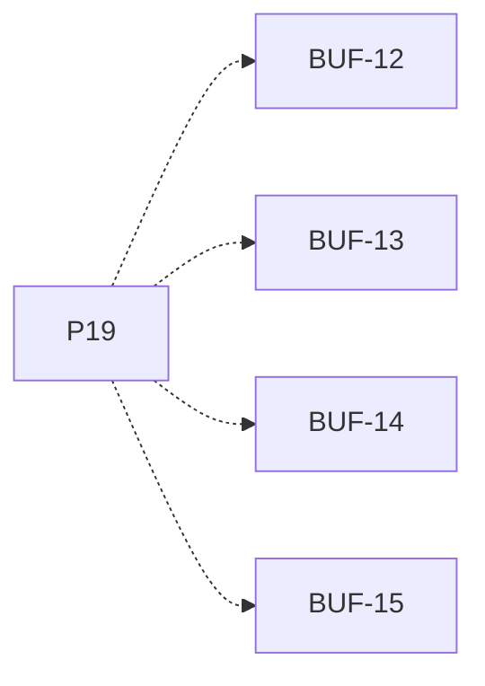

# P19 — Acceso remoto con latencia

[Volver al mapa](../README.md) · **Tipo:** Implementación · **Estado:** propuesta sin aprobación ni implementación comprobada.

## Resultado revisable del paquete

El mismo protocolo funciona entre computadores con bloqueo por latencia y acceso al buffer de su anfitrión.

## Dependencias de integración

[P18 — Productores y consumidores locales](P18.md)

Necesitar esos resultados no impide preparar un boceto, un contrato o casos de prueba antes. No usar mocks como evidencia de integración real.

**Decisiones que condicionan este paquete:** D-11, D-13

Consultar [las dudas explicadas](../../enunciado/dudas-explicadas-proyecto-1.md); este mapa no supone que Ares ya las respondió.

## Qué comprobar al revisar

Comparar acceso local/remoto para productor y consumidor; comprobar ciclos añadidos, datos y contadores coherentes y vencimiento durante espera remota.

## Nivel 2 — Requisitos atómicos asociados

Las líneas del mapa siguiente significan **pertenencia al paquete**, no orden entre requisitos. Los textos completos se conservan debajo para no perder el detalle.

| ID del checklist | Requisito original |
|---|---|
| [BUF-12](../../enunciado/checklist-requerimientos-proyecto-1.md#buf--buffers-distribución-y-latencia) | Soportar productores que acceden a un buffer en otro computador. |
| [BUF-13](../../enunciado/checklist-requerimientos-proyecto-1.md#buf--buffers-distribución-y-latencia) | Soportar consumidores que acceden a un buffer en otro computador. |
| [BUF-14](../../enunciado/checklist-requerimientos-proyecto-1.md#buf--buffers-distribución-y-latencia) | Permitir configurar la latencia de red en ciclos. |
| [BUF-15](../../enunciado/checklist-requerimientos-proyecto-1.md#buf--buffers-distribución-y-latencia) | Bloquear al proceso por cada acceso a un buffer remoto durante la cantidad de ciclos indicada por la latencia de red. |

## Reglas transversales

Aplicar [Git, restricciones y calidad](../transversales.md) según el tipo de cambio. Antes de código sustancial, el estudiante define y explica el mapa de cada función: responsabilidad, entradas, salidas, estado/efectos, conexiones, condiciones, iteraciones/terminación y casos normal/error. Esta ficha no sustituye ese trabajo ni autoriza implementación autónoma.
