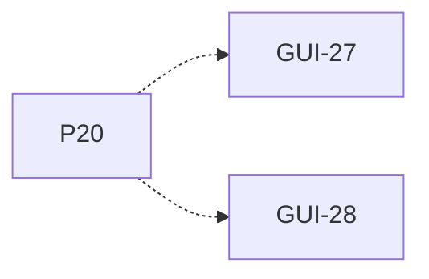

# P20 — Eventos y estado observable

[Volver al mapa](../README.md) · **Tipo:** Implementación · **Estado:** propuesta sin aprobación ni implementación comprobada.

## Resultado revisable del paquete

Contrato y registro de eventos/estado que permite explicar decisiones y alimentar vistas y métricas; log de texto.

## Dependencias de integración

[P03 — Definir contratos y tipos comunes](P03.md); [P05 — Proceso, PCB y estados](P05.md)

Necesitar esos resultados no impide preparar un boceto, un contrato o casos de prueba antes. No usar mocks como evidencia de integración real.

**Decisiones que condicionan este paquete:** D-09

Consultar [las dudas explicadas](../../enunciado/dudas-explicadas-proyecto-1.md); este mapa no supone que Ares ya las respondió.

## Qué comprobar al revisar

Una traza pequeña identifica ciclo, computador, proceso y decisión sin modificar la lógica de planificación desde los observadores.

## Alcance y advertencias de planificación

Empezar temprano con eventos controlados. Cada paquete funcional incorpora luego sus eventos; P26 comprueba que el sistema completo los emita. No esperar hasta el final para definir cómo observar.

## Nivel 2 — Requisitos atómicos asociados

Las líneas del mapa siguiente significan **pertenencia al paquete**, no orden entre requisitos. Los textos completos se conservan debajo para no perder el detalle.

| ID del checklist | Requisito original |
|---|---|
| [GUI-27](../../enunciado/checklist-requerimientos-proyecto-1.md#gui--interfaz-gráfica-y-observabilidad) | Mostrar un log de eventos en formato de texto. |
| [GUI-28](../../enunciado/checklist-requerimientos-proyecto-1.md#gui--interfaz-gráfica-y-observabilidad) | Registrar en el log cada decisión importante del sistema; los ejemplos del enunciado incluyen selección de CPU, bloqueo y acceso remoto. |

## Reglas transversales

Aplicar [Git, restricciones y calidad](../transversales.md) según el tipo de cambio. Antes de código sustancial, el estudiante define y explica el mapa de cada función: responsabilidad, entradas, salidas, estado/efectos, conexiones, condiciones, iteraciones/terminación y casos normal/error. Esta ficha no sustituye ese trabajo ni autoriza implementación autónoma.
