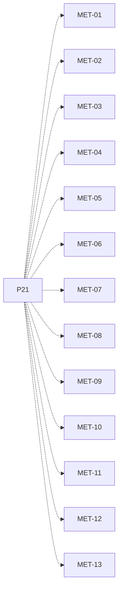

# P21 — Métricas locales y globales

[Volver al mapa](../README.md) · **Tipo:** Implementación · **Estado:** propuesta sin aprobación ni implementación comprobada.

## Resultado revisable del paquete

Cálculos reproducibles por computador y globales, incluyendo trabajo por buffer y espera en semáforos, con fórmulas documentadas.

## Dependencias de integración

[P12 — Deadline y terminación forzada](P12.md); [P19 — Acceso remoto con latencia](P19.md); [P20 — Eventos y estado observable](P20.md)

Necesitar esos resultados no impide preparar un boceto, un contrato o casos de prueba antes. No usar mocks como evidencia de integración real.

**Decisiones que condicionan este paquete:** D-07, D-09

Consultar [las dudas explicadas](../../enunciado/dudas-explicadas-proyecto-1.md); este mapa no supone que Ares ya las respondió.

## Qué comprobar al revisar

Una traza corta con resultados calculados manualmente coincide con cada métrica; incluir terminaciones por deadline y muestras sin datos.

## Alcance y advertencias de planificación

Las fórmulas y pruebas con trazas pueden prepararse en paralelo desde P01/P20; las dependencias señalan la integración con todas las fuentes reales, no una prohibición de diseñar antes.

## Nivel 2 — Requisitos atómicos asociados

Las líneas del mapa siguiente significan **pertenencia al paquete**, no orden entre requisitos. Los textos completos se conservan debajo para no perder el detalle.

| ID del checklist | Requisito original |
|---|---|
| [MET-01](../../enunciado/checklist-requerimientos-proyecto-1.md#met--métricas-de-rendimiento) | Registrar el throughput por computador. |
| [MET-02](../../enunciado/checklist-requerimientos-proyecto-1.md#met--métricas-de-rendimiento) | Registrar el throughput del sistema completo. |
| [MET-03](../../enunciado/checklist-requerimientos-proyecto-1.md#met--métricas-de-rendimiento) | Registrar la utilización del procesador por computador. |
| [MET-04](../../enunciado/checklist-requerimientos-proyecto-1.md#met--métricas-de-rendimiento) | Registrar la utilización del procesador del sistema completo. |
| [MET-05](../../enunciado/checklist-requerimientos-proyecto-1.md#met--métricas-de-rendimiento) | Registrar el tiempo de respuesta promedio por computador. |
| [MET-06](../../enunciado/checklist-requerimientos-proyecto-1.md#met--métricas-de-rendimiento) | Registrar el tiempo de respuesta promedio del sistema completo. |
| [MET-07](../../enunciado/checklist-requerimientos-proyecto-1.md#met--métricas-de-rendimiento) | Registrar la tasa de cumplimiento de deadlines por computador. |
| [MET-08](../../enunciado/checklist-requerimientos-proyecto-1.md#met--métricas-de-rendimiento) | Registrar la tasa de cumplimiento de deadlines del sistema completo. |
| [MET-09](../../enunciado/checklist-requerimientos-proyecto-1.md#met--métricas-de-rendimiento) | Registrar la equidad por computador. |
| [MET-10](../../enunciado/checklist-requerimientos-proyecto-1.md#met--métricas-de-rendimiento) | Registrar la equidad del sistema completo. |
| [MET-11](../../enunciado/checklist-requerimientos-proyecto-1.md#met--métricas-de-rendimiento) | Registrar la cantidad de elementos producidos por buffer. |
| [MET-12](../../enunciado/checklist-requerimientos-proyecto-1.md#met--métricas-de-rendimiento) | Registrar la cantidad de elementos consumidos por buffer. |
| [MET-13](../../enunciado/checklist-requerimientos-proyecto-1.md#met--métricas-de-rendimiento) | Registrar el tiempo promedio que los procesos pasan bloqueados en semáforos. |

## Reglas transversales

Aplicar [Git, restricciones y calidad](../transversales.md) según el tipo de cambio. Antes de código sustancial, el estudiante define y explica el mapa de cada función: responsabilidad, entradas, salidas, estado/efectos, conexiones, condiciones, iteraciones/terminación y casos normal/error. Esta ficha no sustituye ese trabajo ni autoriza implementación autónoma.
