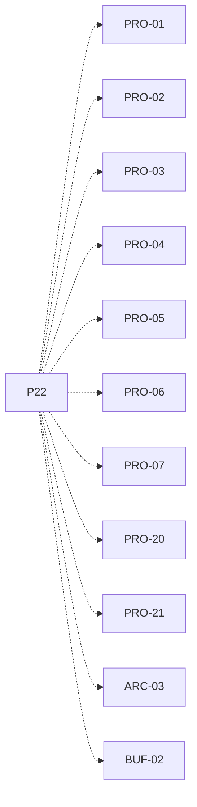

# P22 — Formularios y comandos del usuario

[Volver al mapa](../README.md) · **Tipo:** Implementación · **Estado:** propuesta sin aprobación ni implementación comprobada.

## Resultado revisable del paquete

Entrada de configuración de clúster y alta de procesos/buffers durante la simulación, con asignación y parámetros de cada tipo.

## Dependencias de integración

[P18 — Productores y consumidores locales](P18.md); [P20 — Eventos y estado observable](P20.md)

Necesitar esos resultados no impide preparar un boceto, un contrato o casos de prueba antes. No usar mocks como evidencia de integración real.

**Decisiones que condicionan este paquete:** D-02, D-05, D-06, D-08

Consultar [las dudas explicadas](../../enunciado/dudas-explicadas-proyecto-1.md); este mapa no supone que Ares ya las respondió.

## Qué comprobar al revisar

Crear cargas válidas desde la GUI y rechazar entradas inválidas sin detener el simulador; comprobar asignación estable sin migración.

## Alcance y advertencias de planificación

El boceto del formulario puede avanzar con contratos, antes de integrar la lógica. Reutilizar el computador, creación, memoria y buffers de paquetes anteriores.

## Nivel 2 — Requisitos atómicos asociados

Las líneas del mapa siguiente significan **pertenencia al paquete**, no orden entre requisitos. Los textos completos se conservan debajo para no perder el detalle.

| ID del checklist | Requisito original |
|---|---|
| [PRO-01](../../enunciado/checklist-requerimientos-proyecto-1.md#pro--creación-y-modelo-de-procesos) | Permitir al usuario crear procesos desde la interfaz (Vista 1). |
| [PRO-02](../../enunciado/checklist-requerimientos-proyecto-1.md#pro--creación-y-modelo-de-procesos) | Permitir crear procesos durante la ejecución de la simulación. |
| [PRO-03](../../enunciado/checklist-requerimientos-proyecto-1.md#pro--creación-y-modelo-de-procesos) | Permitir que el usuario indique el nombre del proceso. |
| [PRO-04](../../enunciado/checklist-requerimientos-proyecto-1.md#pro--creación-y-modelo-de-procesos) | Permitir que el usuario indique la cantidad de instrucciones del proceso. |
| [PRO-05](../../enunciado/checklist-requerimientos-proyecto-1.md#pro--creación-y-modelo-de-procesos) | Permitir que el usuario indique la memoria requerida por el proceso. |
| [PRO-06](../../enunciado/checklist-requerimientos-proyecto-1.md#pro--creación-y-modelo-de-procesos) | Permitir que el usuario indique la prioridad del proceso. |
| [PRO-07](../../enunciado/checklist-requerimientos-proyecto-1.md#pro--creación-y-modelo-de-procesos) | Permitir que el usuario seleccione el tipo de proceso. |
| [PRO-20](../../enunciado/checklist-requerimientos-proyecto-1.md#pro--creación-y-modelo-de-procesos) | Asignar cada proceso a un computador mediante una modalidad admitida por el enunciado; ver D-02 sobre manual/automática. |
| [PRO-21](../../enunciado/checklist-requerimientos-proyecto-1.md#pro--creación-y-modelo-de-procesos) | Conservar el computador asignado durante toda la vida del proceso: no hay migración. |
| [ARC-03](../../enunciado/checklist-requerimientos-proyecto-1.md#arc--arquitectura-diseño-y-reloj) | Permitir indicar la cantidad de computadores desde una vista de configuración. |
| [BUF-02](../../enunciado/checklist-requerimientos-proyecto-1.md#buf--buffers-distribución-y-latencia) | Permitir crear buffers durante la ejecución de la simulación. |

## Reglas transversales

Aplicar [Git, restricciones y calidad](../transversales.md) según el tipo de cambio. Antes de código sustancial, el estudiante define y explica el mapa de cada función: responsabilidad, entradas, salidas, estado/efectos, conexiones, condiciones, iteraciones/terminación y casos normal/error. Esta ficha no sustituye ese trabajo ni autoriza implementación autónoma.
