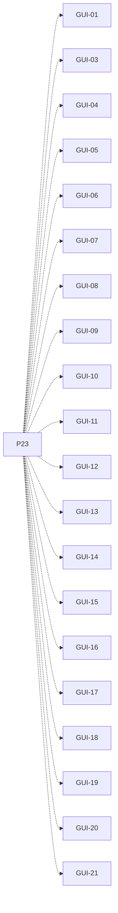

# P23 — Vista por computador

[Volver al mapa](../README.md) · **Tipo:** Implementación · **Estado:** propuesta sin aprobación ni implementación comprobada.

## Resultado revisable del paquete

Vista de CPU, PCB, colas/motivos, memoria y política con cambios visibles y selector de política.

## Dependencias de integración

[P15 — Cambio de política por computador](P15.md); [P20 — Eventos y estado observable](P20.md); [P22 — Formularios y comandos del usuario](P22.md)

Necesitar esos resultados no impide preparar un boceto, un contrato o casos de prueba antes. No usar mocks como evidencia de integración real.

**Decisiones que condicionan este paquete:** Ninguna D-xx identificada específicamente.

Consultar [las dudas explicadas](../../enunciado/dudas-explicadas-proyecto-1.md); este mapa no supone que Ares ya las respondió.

## Qué comprobar al revisar

Recorrer un escenario y contrastar cada elemento mostrado con el estado real; comprobar reordenamiento sin reconstruir decisiones dentro de la GUI.

## Alcance y advertencias de planificación

Construir visualmente con datos de ejemplo puede adelantarse; el cierre exige conectar las acciones y el estado real.

## Nivel 2 — Requisitos atómicos asociados

Las líneas del mapa siguiente significan **pertenencia al paquete**, no orden entre requisitos. Los textos completos se conservan debajo para no perder el detalle.

| ID del checklist | Requisito original |
|---|---|
| [GUI-01](../../enunciado/checklist-requerimientos-proyecto-1.md#gui--interfaz-gráfica-y-observabilidad) | Entregar una interfaz gráfica funcional; una solución sólo por consola no cumple. |
| [GUI-03](../../enunciado/checklist-requerimientos-proyecto-1.md#gui--interfaz-gráfica-y-observabilidad) | Visualizar los cambios de estado de procesos en tiempo real. |
| [GUI-04](../../enunciado/checklist-requerimientos-proyecto-1.md#gui--interfaz-gráfica-y-observabilidad) | Mostrar el proceso que está ejecutándose en la CPU de cada computador. |
| [GUI-05](../../enunciado/checklist-requerimientos-proyecto-1.md#gui--interfaz-gráfica-y-observabilidad) | Mostrar el valor del PC del proceso en ejecución en cada computador. |
| [GUI-06](../../enunciado/checklist-requerimientos-proyecto-1.md#gui--interfaz-gráfica-y-observabilidad) | Mostrar la instrucción cuya dirección indica el PC, según el planteamiento; ver D-05 sobre su representación. |
| [GUI-07](../../enunciado/checklist-requerimientos-proyecto-1.md#gui--interfaz-gráfica-y-observabilidad) | Mostrar la prioridad del proceso en ejecución en cada computador. |
| [GUI-08](../../enunciado/checklist-requerimientos-proyecto-1.md#gui--interfaz-gráfica-y-observabilidad) | Mostrar el deadline del proceso en ejecución en cada computador. |
| [GUI-09](../../enunciado/checklist-requerimientos-proyecto-1.md#gui--interfaz-gráfica-y-observabilidad) | Mostrar si cada CPU ejecuta en modo usuario o sistema operativo. |
| [GUI-10](../../enunciado/checklist-requerimientos-proyecto-1.md#gui--interfaz-gráfica-y-observabilidad) | Mostrar la cola de nuevos de cada computador. |
| [GUI-11](../../enunciado/checklist-requerimientos-proyecto-1.md#gui--interfaz-gráfica-y-observabilidad) | Mostrar la cola de listos de cada computador. |
| [GUI-12](../../enunciado/checklist-requerimientos-proyecto-1.md#gui--interfaz-gráfica-y-observabilidad) | Mostrar la cola de bloqueados de cada computador. |
| [GUI-13](../../enunciado/checklist-requerimientos-proyecto-1.md#gui--interfaz-gráfica-y-observabilidad) | Mostrar el motivo de bloqueo de cada proceso bloqueado. |
| [GUI-14](../../enunciado/checklist-requerimientos-proyecto-1.md#gui--interfaz-gráfica-y-observabilidad) | Mostrar la cola de terminados de cada computador. |
| [GUI-15](../../enunciado/checklist-requerimientos-proyecto-1.md#gui--interfaz-gráfica-y-observabilidad) | Reflejar inmediatamente en la GUI los cambios de ordenamiento de las colas. |
| [GUI-16](../../enunciado/checklist-requerimientos-proyecto-1.md#gui--interfaz-gráfica-y-observabilidad) | Mostrar los elementos del PCB de cada proceso situado en las colas. |
| [GUI-17](../../enunciado/checklist-requerimientos-proyecto-1.md#gui--interfaz-gráfica-y-observabilidad) | Mostrar los elementos del PCB del proceso situado en cada CPU. |
| [GUI-18](../../enunciado/checklist-requerimientos-proyecto-1.md#gui--interfaz-gráfica-y-observabilidad) | Mostrar la memoria usada de cada computador. |
| [GUI-19](../../enunciado/checklist-requerimientos-proyecto-1.md#gui--interfaz-gráfica-y-observabilidad) | Mostrar la memoria libre de cada computador. |
| [GUI-20](../../enunciado/checklist-requerimientos-proyecto-1.md#gui--interfaz-gráfica-y-observabilidad) | Mostrar la política de planificación vigente en cada computador. |
| [GUI-21](../../enunciado/checklist-requerimientos-proyecto-1.md#gui--interfaz-gráfica-y-observabilidad) | Proporcionar un selector de política para cada computador. |

## Reglas transversales

Aplicar [Git, restricciones y calidad](../transversales.md) según el tipo de cambio. Antes de código sustancial, el estudiante define y explica el mapa de cada función: responsabilidad, entradas, salidas, estado/efectos, conexiones, condiciones, iteraciones/terminación y casos normal/error. Esta ficha no sustituye ese trabajo ni autoriza implementación autónoma.
