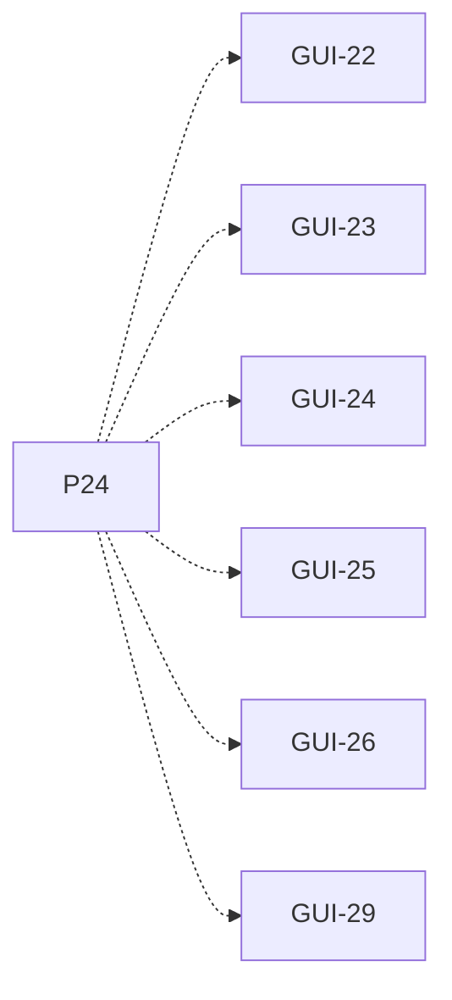

# P24 — Vista global y gráfico

[Volver al mapa](../README.md) · **Tipo:** Implementación · **Estado:** propuesta sin aprobación ni implementación comprobada.

## Resultado revisable del paquete

Vista global de reloj, buffers y semáforos/esperas, junto con el gráfico común de utilización por computador.

## Dependencias de integración

[P19 — Acceso remoto con latencia](P19.md); [P21 — Métricas locales y globales](P21.md); [P23 — Vista por computador](P23.md)

Necesitar esos resultados no impide preparar un boceto, un contrato o casos de prueba antes. No usar mocks como evidencia de integración real.

**Decisiones que condicionan este paquete:** Ninguna D-xx identificada específicamente.

Consultar [las dudas explicadas](../../enunciado/dudas-explicadas-proyecto-1.md); este mapa no supone que Ares ya las respondió.

## Qué comprobar al revisar

Mostrar dos computadores y buffers locales/remotos; contrastar gráfico y valores con muestras de métricas, no con contadores paralelos de la GUI.

## Nivel 2 — Requisitos atómicos asociados

Las líneas del mapa siguiente significan **pertenencia al paquete**, no orden entre requisitos. Los textos completos se conservan debajo para no perder el detalle.

| ID del checklist | Requisito original |
|---|---|
| [GUI-22](../../enunciado/checklist-requerimientos-proyecto-1.md#gui--interfaz-gráfica-y-observabilidad) | Mostrar globalmente el número de ciclo desde el inicio de la simulación. |
| [GUI-23](../../enunciado/checklist-requerimientos-proyecto-1.md#gui--interfaz-gráfica-y-observabilidad) | Mostrar los elementos almacenados en cada buffer. |
| [GUI-24](../../enunciado/checklist-requerimientos-proyecto-1.md#gui--interfaz-gráfica-y-observabilidad) | Mostrar la capacidad de cada buffer. |
| [GUI-25](../../enunciado/checklist-requerimientos-proyecto-1.md#gui--interfaz-gráfica-y-observabilidad) | Mostrar los valores de los semáforos de cada buffer. |
| [GUI-26](../../enunciado/checklist-requerimientos-proyecto-1.md#gui--interfaz-gráfica-y-observabilidad) | Mostrar los procesos bloqueados en cada semáforo de cada buffer. |
| [GUI-29](../../enunciado/checklist-requerimientos-proyecto-1.md#gui--interfaz-gráfica-y-observabilidad) | Mostrar la utilización del procesador de cada computador con respecto al tiempo en un mismo gráfico. |

## Reglas transversales

Aplicar [Git, restricciones y calidad](../transversales.md) según el tipo de cambio. Antes de código sustancial, el estudiante define y explica el mapa de cada función: responsabilidad, entradas, salidas, estado/efectos, conexiones, condiciones, iteraciones/terminación y casos normal/error. Esta ficha no sustituye ese trabajo ni autoriza implementación autónoma.
