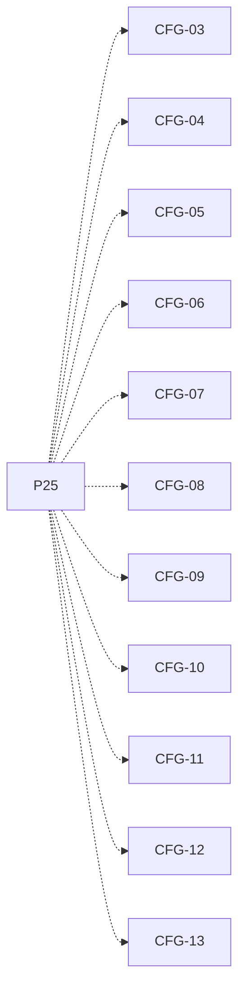

# P25 — Guardar y cargar configuración

[Volver al mapa](../README.md) · **Tipo:** Implementación · **Estado:** propuesta sin aprobación ni implementación comprobada.

## Resultado revisable del paquete

Configuración inicial completa desde GUI, serializada en el formato elegido y recuperable para otra simulación.

## Dependencias de integración

[P15 — Cambio de política por computador](P15.md); [P19 — Acceso remoto con latencia](P19.md); [P22 — Formularios y comandos del usuario](P22.md)

Necesitar esos resultados no impide preparar un boceto, un contrato o casos de prueba antes. No usar mocks como evidencia de integración real.

**Decisiones que condicionan este paquete:** D-05, D-06, D-07, D-08

Consultar [las dudas explicadas](../../enunciado/dudas-explicadas-proyecto-1.md); este mapa no supone que Ares ya las respondió.

## Qué comprobar al revisar

Guardar y recargar una configuración con varios tipos y buffers; comparar atributos y validar archivos/entradas erróneos.

## Alcance y advertencias de planificación

Se guarda configuración para futuras simulaciones; no inventar como requisito un checkpoint de ejecución a mitad de ciclo.

## Nivel 2 — Requisitos atómicos asociados

Las líneas del mapa siguiente significan **pertenencia al paquete**, no orden entre requisitos. Los textos completos se conservan debajo para no perder el detalle.

| ID del checklist | Requisito original |
|---|---|
| [CFG-03](../../enunciado/checklist-requerimientos-proyecto-1.md#cfg--configuración-y-persistencia) | Permitir introducir desde la GUI la duración del ciclo para la configuración persistente. |
| [CFG-04](../../enunciado/checklist-requerimientos-proyecto-1.md#cfg--configuración-y-persistencia) | Permitir introducir desde la GUI el número de computadores para la configuración persistente. |
| [CFG-05](../../enunciado/checklist-requerimientos-proyecto-1.md#cfg--configuración-y-persistencia) | Permitir introducir desde la GUI la RAM de cada computador para la configuración persistente. |
| [CFG-06](../../enunciado/checklist-requerimientos-proyecto-1.md#cfg--configuración-y-persistencia) | Permitir introducir desde la GUI la política inicial de cada computador para la configuración persistente. |
| [CFG-07](../../enunciado/checklist-requerimientos-proyecto-1.md#cfg--configuración-y-persistencia) | Permitir introducir desde la GUI el quantum para la configuración persistente. |
| [CFG-08](../../enunciado/checklist-requerimientos-proyecto-1.md#cfg--configuración-y-persistencia) | Permitir introducir desde la GUI la latencia de red en ciclos para la configuración persistente. |
| [CFG-09](../../enunciado/checklist-requerimientos-proyecto-1.md#cfg--configuración-y-persistencia) | Permitir introducir desde la GUI la carga inicial de procesos con todos sus atributos. |
| [CFG-10](../../enunciado/checklist-requerimientos-proyecto-1.md#cfg--configuración-y-persistencia) | Permitir introducir desde la GUI la carga inicial de buffers con su capacidad. |
| [CFG-11](../../enunciado/checklist-requerimientos-proyecto-1.md#cfg--configuración-y-persistencia) | Permitir introducir desde la GUI el anfitrión de cada buffer de la carga inicial. |
| [CFG-12](../../enunciado/checklist-requerimientos-proyecto-1.md#cfg--configuración-y-persistencia) | Escribir la configuración indicada en un archivo CSV o JSON; basta uno de esos formatos. |
| [CFG-13](../../enunciado/checklist-requerimientos-proyecto-1.md#cfg--configuración-y-persistencia) | Recuperar y utilizar la configuración guardada en simulaciones futuras. |

## Reglas transversales

Aplicar [Git, restricciones y calidad](../transversales.md) según el tipo de cambio. Antes de código sustancial, el estudiante define y explica el mapa de cada función: responsabilidad, entradas, salidas, estado/efectos, conexiones, condiciones, iteraciones/terminación y casos normal/error. Esta ficha no sustituye ese trabajo ni autoriza implementación autónoma.
