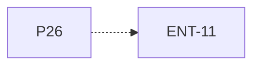

# P26 — Integración y comprobación de requisitos

[Volver al mapa](../README.md) · **Tipo:** Verificación · **Estado:** propuesta sin aprobación ni implementación comprobada.

## Resultado revisable del paquete

Revisión integrada de los escenarios y evidencia vinculada a IDs del checklist, con ejecución real en NetBeans.

## Dependencias de integración

[P24 — Vista global y gráfico](P24.md); [P25 — Guardar y cargar configuración](P25.md)

Necesitar esos resultados no impide preparar un boceto, un contrato o casos de prueba antes. No usar mocks como evidencia de integración real.

**Decisiones que condicionan este paquete:** D-01, D-04, D-05, D-06, D-07, D-08, D-09, D-10, D-11, D-12, D-13, D-16

Consultar [las dudas explicadas](../../enunciado/dudas-explicadas-proyecto-1.md); este mapa no supone que Ares ya las respondió.

## Qué comprobar al revisar

Cubrir admisión, CPU/E/S, políticas requeridas, bloqueo local/remoto, cancelación por deadline, GUI, métricas y recuperación de configuración. Verificar que no se cumple un ID sólo con una caja dibujada.

## Alcance y advertencias de planificación

Las dependencias del grafo llegan transitivamente a los paquetes funcionales. Es una puerta de cierre; cada PR anterior tiene su propia comprobación. No acumular todas las pruebas aquí.

## Nivel 2 — Requisitos atómicos asociados

Las líneas del mapa siguiente significan **pertenencia al paquete**, no orden entre requisitos. Los textos completos se conservan debajo para no perder el detalle.

| ID del checklist | Requisito original |
|---|---|
| [ENT-11](../../enunciado/checklist-requerimientos-proyecto-1.md#ent--entrega-y-defensa) | Entregar un programa que se ejecute adecuadamente. |

## Reglas transversales

Aplicar [Git, restricciones y calidad](../transversales.md) según el tipo de cambio. Antes de código sustancial, el estudiante define y explica el mapa de cada función: responsabilidad, entradas, salidas, estado/efectos, conexiones, condiciones, iteraciones/terminación y casos normal/error. Esta ficha no sustituye ese trabajo ni autoriza implementación autónoma.
