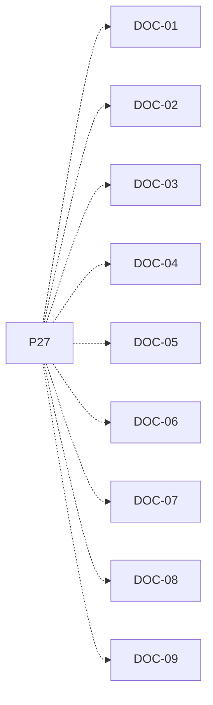

# P27 — Informe y diagramas finales

[Volver al mapa](../README.md) · **Tipo:** Documentación · **Estado:** propuesta sin aprobación ni implementación comprobada.

## Resultado revisable del paquete

Informe con clases/métodos principales, enums/interfaces, dos UML y conclusiones sustentadas en ejecuciones de las políticas y escenarios locales/remotos.

## Dependencias de integración

[P26 — Integración y comprobación de requisitos](P26.md)

Necesitar esos resultados no impide preparar un boceto, un contrato o casos de prueba antes. No usar mocks como evidencia de integración real.

**Decisiones que condicionan este paquete:** D-14

Consultar [las dudas explicadas](../../enunciado/dudas-explicadas-proyecto-1.md); este mapa no supone que Ares ya las respondió.

## Qué comprobar al revisar

Diagrama y explicación coinciden con la revisión final de código. Los resultados utilizados en conclusiones tienen evidencia.

## Alcance y advertencias de planificación

Abrir el borrador desde P03; la dependencia de P26 corresponde al cierre con resultados reales. El diagrama de capas es apoyo, no reemplazo de los UML acordados.

## Nivel 2 — Requisitos atómicos asociados

Las líneas del mapa siguiente significan **pertenencia al paquete**, no orden entre requisitos. Los textos completos se conservan debajo para no perder el detalle.

| ID del checklist | Requisito original |
|---|---|
| [DOC-01](../../enunciado/checklist-requerimientos-proyecto-1.md#doc--informe-y-documentación) | Entregar un informe junto con el código. |
| [DOC-02](../../enunciado/checklist-requerimientos-proyecto-1.md#doc--informe-y-documentación) | Explicar en el informe la funcionalidad de las clases más importantes. |
| [DOC-03](../../enunciado/checklist-requerimientos-proyecto-1.md#doc--informe-y-documentación) | Explicar en el informe la funcionalidad de los métodos más importantes. |
| [DOC-04](../../enunciado/checklist-requerimientos-proyecto-1.md#doc--informe-y-documentación) | Describir en el informe los enums utilizados. |
| [DOC-05](../../enunciado/checklist-requerimientos-proyecto-1.md#doc--informe-y-documentación) | Describir en el informe las interfaces utilizadas. |
| [DOC-06](../../enunciado/checklist-requerimientos-proyecto-1.md#doc--informe-y-documentación) | Incluir dos diagramas UML que describan el sistema; el enunciado no identifica sus tipos. |
| [DOC-07](../../enunciado/checklist-requerimientos-proyecto-1.md#doc--informe-y-documentación) | Incluir conclusiones sobre el comportamiento del sistema con cada política de planificación implementada. |
| [DOC-08](../../enunciado/checklist-requerimientos-proyecto-1.md#doc--informe-y-documentación) | Incluir conclusiones sobre productores y consumidores con acceso local. |
| [DOC-09](../../enunciado/checklist-requerimientos-proyecto-1.md#doc--informe-y-documentación) | Incluir conclusiones sobre productores y consumidores con acceso remoto. |

## Reglas transversales

Aplicar [Git, restricciones y calidad](../transversales.md) según el tipo de cambio. Antes de código sustancial, el estudiante define y explica el mapa de cada función: responsabilidad, entradas, salidas, estado/efectos, conexiones, condiciones, iteraciones/terminación y casos normal/error. Esta ficha no sustituye ese trabajo ni autoriza implementación autónoma.
