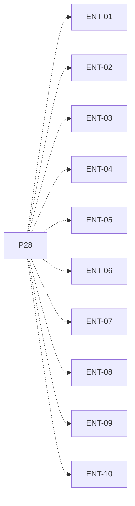

# P28 — Entrega y preparación de defensa

[Volver al mapa](../README.md) · **Tipo:** Cierre · **Estado:** propuesta sin aprobación ni implementación comprobada.

## Resultado revisable del paquete

Informe PDF, enlaces y registro de entrega preparados, destinatarios/fecha confirmados y recorrido de defensa por cada integrante.

## Dependencias de integración

[P27 — Informe y diagramas finales](P27.md)

Necesitar esos resultados no impide preparar un boceto, un contrato o casos de prueba antes. No usar mocks como evidencia de integración real.

**Decisiones que condicionan este paquete:** D-15

Consultar [las dudas explicadas](../../enunciado/dudas-explicadas-proyecto-1.md); este mapa no supone que Ares ya las respondió.

## Qué comprobar al revisar

Comprobar contenido entregable, destinatarios, spreadsheet y fecha; cada integrante explica los módulos y puede recorrer un caso.

## Alcance y advertencias de planificación

Paquete de cierre: no todo se convierte en un PR de código. Enviar mensajes, registrar entregas o modificar GitHub requiere autorización de la acción concreta; este plan no las ejecuta.

## Nivel 2 — Requisitos atómicos asociados

Las líneas del mapa siguiente significan **pertenencia al paquete**, no orden entre requisitos. Los textos completos se conservan debajo para no perder el detalle.

| ID del checklist | Requisito original |
|---|---|
| [ENT-01](../../enunciado/checklist-requerimientos-proyecto-1.md#ent--entrega-y-defensa) | Completar la entrega antes de las 7:00 AM del viernes de la Semana 7; no se infiere aquí una fecha de calendario. |
| [ENT-02](../../enunciado/checklist-requerimientos-proyecto-1.md#ent--entrega-y-defensa) | Entregar el informe en formato PDF. |
| [ENT-03](../../enunciado/checklist-requerimientos-proyecto-1.md#ent--entrega-y-defensa) | Enviar el informe a Gabriela Costa. |
| [ENT-04](../../enunciado/checklist-requerimientos-proyecto-1.md#ent--entrega-y-defensa) | Enviar el informe a Ares Ramirez. |
| [ENT-05](../../enunciado/checklist-requerimientos-proyecto-1.md#ent--entrega-y-defensa) | Enviar el enlace del repositorio GitHub a Gabriela Costa. |
| [ENT-06](../../enunciado/checklist-requerimientos-proyecto-1.md#ent--entrega-y-defensa) | Enviar el enlace del repositorio GitHub a Ares Ramirez. |
| [ENT-07](../../enunciado/checklist-requerimientos-proyecto-1.md#ent--entrega-y-defensa) | Registrar la entrega en el spreadsheet que se proporcionará. |
| [ENT-08](../../enunciado/checklist-requerimientos-proyecto-1.md#ent--entrega-y-defensa) | Asistir todos los integrantes a la defensa presencial del viernes de la Semana 7. |
| [ENT-09](../../enunciado/checklist-requerimientos-proyecto-1.md#ent--entrega-y-defensa) | Demostrar individualmente conocimientos sobre el proyecto durante la defensa. |
| [ENT-10](../../enunciado/checklist-requerimientos-proyecto-1.md#ent--entrega-y-defensa) | Asegurar que cada integrante conozca el funcionamiento general de cada módulo de la solución. |

## Reglas transversales

Aplicar [Git, restricciones y calidad](../transversales.md) según el tipo de cambio. Antes de código sustancial, el estudiante define y explica el mapa de cada función: responsabilidad, entradas, salidas, estado/efectos, conexiones, condiciones, iteraciones/terminación y casos normal/error. Esta ficha no sustituye ese trabajo ni autoriza implementación autónoma.
